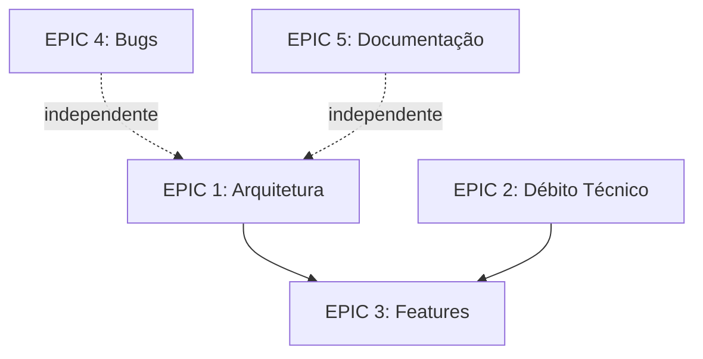

# EPICs - Organização de Issues por Tema

Este diretório contém **Épicos** (EPICs) que agrupam issues relacionadas por tema ou objetivo estratégico.

---

## 📋 O que é um EPIC?

Um **EPIC** é um agrupamento de issues (bugs, features, refatorações) que compartilham:
- **Objetivo comum**
- **Contexto similar**
- **Dependências entre si**

**Benefícios**:
- ✅ Visão estratégica do trabalho
- ✅ Priorização clara
- ✅ Tracking de progresso por tema
- ✅ Planejamento de releases

---

## 🗂️ EPICs da v2.8.0

### [EPIC 1: Arquitetura e Refatoração](EPIC-1-arquitetura-refatoracao.md)
**Objetivo**: Resolver violações de SRP e separação de camadas

**Issues**:
- REFACTOR-desacoplar-scraping-view
- REFACTOR-persistencia-courseweektasksview

**Progresso**: 2/2 (100%) ✅  
**Tempo real**: ~8 horas (concluído em 2025-12-23)

---

### [EPIC 2: Débito Técnico e Qualidade](EPIC-2-debito-tecnico-qualidade.md)
**Objetivo**: Resolver inconsistências estruturais e melhorar qualidade

**Issues**:
- ✅ TECH_DEBT-unificar-estrutura-progresso (concluído)
- TECH_DEBT-breadcrumb-estado-global
- TECH_DEBT-cobertura-testes-courses

**Progresso**: 1/3 (80%) ✅  
**Tempo real**: 6 horas (primeiro issue)  
**Estimativa restante**: 5-7 horas

---

### [EPIC 3: Features de Gestão de Tarefas](EPIC-3-features-gestao-tarefas.md)
**Objetivo**: Implementar features de produto para controle de progresso

**Issues**:
- FEATURE-checkbox-conclusao
- NEXT-CSS-details-activities

**Progresso**: 1/2 (40% - navegação implementada)  
**Estimativa**: 4-6 horas

---

### [EPIC 4: Bugs e Estabilidade](EPIC-4-bugs-estabilidade.md)
**Objetivo**: Corrigir bugs conhecidos que afetam UX

**Issues**:
- BUG-navegacao-abas
- BUG-botao-abrir-materia

**Progresso**: 0/2 (0%)  
**Estimativa**: 2-3 horas

---

### [EPIC 5: Documentação e Conhecimento](EPIC-5-documentacao-conhecimento.md)
**Objetivo**: Melhorar base de conhecimento técnico

**Issues**:
- NEXT-doc-chrome-tabs-api

**Progresso**: 0/1 (20% - docs parciais)  
**Estimativa**: 2-3 horas

---

## 📊 Visão Geral

### Por Prioridade

| Prioridade | EPICs |
|------------|-------|
| 🔴 **Alta** | EPIC 1, EPIC 3, EPIC 4 |
| 🟡 **Média** | EPIC 2 |
| 🟢 **Baixa** | EPIC 5 |

### Por Status

| Status | EPICs |
|--------|-------|
| 🚀 **Ativo** | EPIC 3 |
| 🔧 **Em Progresso** | EPIC 1, EPIC 5 |
| 📊 **Análise** | EPIC 2 |
| 🐛 **Correção** | EPIC 4 |

### Total de Issues: 10

```
Distribuição:
├── REFACTOR/    2 issues
├── TECH_DEBT/   3 issues
├── FEATURE/     1 issue
├── ISSUES/      2 bugs
└── NEXT/        2 melhorias
```

---

## 🎯 Dependências entre EPICs



**Ordem recomendada**:
1. EPIC 4 (Bugs) - Rápido, independente
2. EPIC 1 (Arquitetura) - Desbloqueia EPIC 3
3. EPIC 2 (Débito Técnico) - Prepara estrutura
4. EPIC 3 (Features) - Implementação final
5. EPIC 5 (Documentação) - Paralelo

---

## 📝 Como Usar

### Para Desenvolvedores

1. **Escolha um EPIC** baseado em prioridade
2. **Leia o arquivo do EPIC** para entender contexto
3. **Escolha uma issue** dentro do EPIC
4. **Implemente** seguindo TDD e padrões do projeto

### Para Product Owner

1. **Revise progresso** de cada EPIC
2. **Repriorize** conforme necessário
3. **Acompanhe** estimativas vs realizado

---

## 🔗 Documentos Relacionados

- [SPEC v2.8.0](file:///home/sant/extensaoUNIVESP/.github/SPEC-v2.8.0.md) - Especificação técnica completa
- [Roadmap](file:///home/sant/extensaoUNIVESP/docs/ROADMAP_FEATURES.md) - Visão de longo prazo
- [Fluxos de Trabalho](file:///home/sant/extensaoUNIVESP/docs/FLUXOS_DE_TRABALHO.md) - Protocolos de desenvolvimento

---

**Última Atualização**: 2025-12-23
