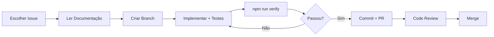

# 📋 .github - Gestão de Projeto

**Versão**: v2.9.1  
**Última atualização**: 2025-12-29

---

## 📂 Estrutura

```
.github/
├── ADR/           ← Architecture Decision Records (decisões técnicas)
├── EPICS/         ← Meta-categorias de organização (sempre ativas)
├── FEATURE/       ← Features implementadas (histórico)
├── ISSUES/        ← Bugs ATIVOS
├── RESOLVED/      ← Bugs RESOLVIDOS (histórico)
├── REFACTOR/      ← Refatorações planejadas
├── TECH_DEBT/     ← Débitos técnicos catalogados
└── ARCHIVED/      ← Documentação obsoleta
```

---

## 🎯 Status Atual

### ✅ Bugs Resolvidos
- [`BUG-navegacao-abas.md`](RESOLVED/BUG-navegacao-abas.md) - Resolvido (Tabs.js refatorado)
- [`BUG-fechar-listador-de-atividades-do-site.md`](RESOLVED/BUG-fechar-listador-de-atividades-do-site.md) - Implementado (DomUtils.ensureModalClosed)
- [`BUG-botao-abrir-materia.md`](RESOLVED/BUG-botao-abrir-materia.md) - Resolvido (Link com data-match-pattern)

### ✨ Features Implementadas
- [`FEATURE-checkbox-conclusao.md`](FEATURE/FEATURE-checkbox-conclusao.md) - Sistema de progresso (v2.8.0)
- [`FEATURE-chips-navegacao-contextual.md`](FEATURE/FEATURE-chips-navegacao-contextual.md) - Navegação contextual

### 🔧 Débitos Técnicos
- [`TECH_DEBT-breadcrumb-estado-global.md`](TECH_DEBT/TECH_DEBT-breadcrumb-estado-global.md) - Estado de navegação
- [`TECH_DEBT-cobertura-testes-courses.md`](TECH_DEBT/TECH_DEBT-cobertura-testes-courses.md) - Cobertura de testes

### 📦 Débitos Técnicos Resolvidos (Arquivados)
- [`TECH_DEBT-unificar-estrutura-progresso.md`](ARCHIVED/TECH_DEBT-unificar-estrutura-progresso.md) - ActivityProgress implementado

### 📐 Refatorações Planejadas
- [`REFACTOR-modernizacao-es2024.md`](REFACTOR/REFACTOR-modernizacao-es2024.md) - Baixa prioridade

### 📦 Refatorações Concluídas (Arquivadas)
- [`REFACTOR-desacoplar-scraping-view.md`](ARCHIVED/REFACTOR-desacoplar-scraping-view.md) - WeekActivitiesService
- [`REFACTOR-persistencia-courseweektasksview.md`](ARCHIVED/REFACTOR-persistencia-courseweektasksview.md) - TaskProgressService


### 🎯 Decisões Arquiteturais (ADRs)

**Processo/Organização** (`.github/ADR/`):
- [`ADR-001: Console Cleanup`](ADR/ADR-001-tech-debt-console-cleanup.md) - Priorização de TECH_DEBT
- [`ADR-002: Deletar EPICs`](ADR/ADR-002-deletar-epics-obsoletos.md) - Organização documental

**Técnicas/Arquiteturais** (`docs/architecture/`):
- [`ADR-003: BatchScraper No Modularization`](../docs/architecture/ADR_003_BATCHSCRAPER_NO_MODULARIZATION.md) - Injected code constraint
- [`ADR-004: Navigation Breadcrumb Logic`](../docs/architecture/ADR_004_NAVIGATION_BREADCRUMB_LOGIC.md) - Navegação hierárquica
- [`ADR-005: SafeResult Pattern`](../docs/architecture/ADR_005_SAFERESULT_PATTERN.md) - Error handling robusto
- [`ADR-006: Container Freshness`](../docs/architecture/ADR_006_CONTAINER_FRESHNESS.md) - DOM Zumbi fix


---

## 🚀 Por Onde Começar?

### Para Novos Desenvolvedores

1. **Entenda o Projeto**:
   - Leia [`README.md`](../README.md) principal
   - Revise [`docs/ROADMAP_FEATURES.md`](../docs/ROADMAP_FEATURES.md)

2. **Estude as Decisões Arquiteturais**:
   - Comece pelos ADRs em ordem (ADR-001, ADR-002, ADR-003)
   - Entenda **por que** certas escolhas foram feitas

3. **Escolha Sua Primeira Tarefa**:
   - **Fácil**: Bugs em investigação (`ISSUES/`)
   - **Médio**: Débitos técnicos (`TECH_DEBT/`)
   - **Avançado**: Refatorações (`REFACTOR/`)

### Priorização Recomendada (2025-12-27)

#### 🔴 Alta Prioridade
1. **TECH_DEBT-breadcrumb-estado-global** - Impacta UX

#### 🟡 Média Prioridade
2. **TECH_DEBT-cobertura-testes** - Aumentar cobertura para 85%+

#### 🟢 Baixa Prioridade
5. **REFACTOR-modernizacao-es2024** - Melhorias de código (ROI questionável)

### Workflow de Trabalho



### Regras de Ouro

- ✅ **Sempre** rode `npm run verify` antes de commitar
- ✅ **Sempre** escreva testes (TDD quando possível)
- ✅ **Sempre** siga convenções de commit (ver `docs/PADROES.md`)
- ✅ **Sempre** atualize documentação relevante
- ❌ **Nunca** commite código comentado ou console.log
- ❌ **Nunca** faça refactor sem testes passando (Green-Green)

---

## 🗂️ Convenções

### Nomenclatura
- `ADR-XXX-*.md` - Architecture Decision Records
- `BUG-*.md` - Bugs identificados
- `FEATURE-*.md` - Features implementadas
- `REFACTOR-*.md` - Refatorações planejadas
- `TECH_DEBT-*.md` - Débitos técnicos

### Status
- 🐛 Bug Ativo
- ✅ Resolvido/Implementado
- 🔧 Débito Técnico Catalogado
- 📋 Planejado

---

**Auditoria**: 2025-12-29 (v2.9.1 - Release de Robustez com Logging Estruturado e Fix de Scroll)
