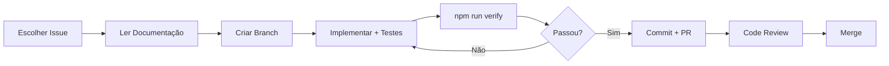

# 📋 .github - Gestão de Projeto

**Versão**: v2.9.1  
**Última atualização**: 2025-12-29

---

## 📂 Estrutura

```
.github/
├── TECH_DEBT/     ← Débitos técnicos ATIVOS
├── README.md      ← Este guia
└── ROADMAP.md     ← Visão estratégica (Q1 2026)
```

> [!NOTE]
> Os diretórios de histórico (`FEATURE`, `RESOLVED`, `ARCHIVED`) foram removidos. O histórico de implementações reside no Git e no `CHANGELOG.md`.

---

## 🎯 Débitos Técnicos Ativos

As prioridades atuais de manutenção são:

1. [`TECH_DEBT-breadcrumb-estado-global.md`](TECH_DEBT/TECH_DEBT-breadcrumb-estado-global.md) - Impacta UX de navegação.
2. [`TECH_DEBT-cobertura-testes-courses.md`](TECH_DEBT/TECH_DEBT-cobertura-testes-courses.md) - Meta de 85% de cobertura.

---

## 📐 Decisões Técnicas (ADRs)

A fundação e evolução da arquitetura (2025):

### Fundações (Core Strategy)
- [**ADR 000-A: Screaming Architecture**](../docs/architecture/ADR_000_A_SCREAMING_ARCHITECTURE.md) (Organização por Features)
- [**ADR 000-B: JSDoc Typing**](../docs/architecture/ADR_000_B_JSDOC_TYPING.md) (Tipagem sem Build Step)
- [**ADR 000-C: Padrão AAA**](../docs/architecture/ADR_000_C_AAA_TESTING_PATTERN.md) (Qualidade de Testes)

### Ciclo de Estabilização (v2.8.9 → v2.9.1)
- [**📊 Plano de Observabilidade**](../docs/architecture/OBSERVABILITY_PLAN.md) (Structured Logging)
1. [**ADR 001: Higiene Documental**](../docs/architecture/ADR_001_DOCS_CLEANUP.md) (27/dez)
2. [**ADR 002: BatchScraper Architecture**](../docs/architecture/ADR_002_BATCHSCRAPER_ARCHITECTURE.md) (27/dez)
3. [**ADR 003: SafeResult Pattern**](../docs/architecture/ADR_003_SAFERESULT_PATTERN.md) (29/dez am)
4. [**ADR 004: Container Freshness**](../docs/architecture/ADR_004_CONTAINER_FRESHNESS.md) (29/dez am)
5. [**ADR 005: Observabilidade**](../docs/architecture/ADR_005_OBSERVABILITY_LOGGER.md) (29/dez pm)
6. [**ADR 006: Robust Scroll Navigation**](../docs/architecture/ADR_006_ROBUST_SCROLL_NAVIGATION.md) (29/dez pm)
7. [**ADR 007: Navigation Hierarchy**](../docs/architecture/ADR_007_NAVIGATION_HIERARCHY.md) (v2.9.1)


---

## 🚀 Por Onde Começar?

### Para Novos Desenvolvedores

1. **Entenda o Projeto**:
   - Leia [`README.md`](../README.md) principal
   - Revise [`docs/ROADMAP_FEATURES.md`](../docs/ROADMAP_FEATURES.md)

2. **Estude as Decisões Arquiteturais**:
   - Comece pelos ADRs em ordem (ADR-001, ADR-002, ADR-003)
   - Entenda **por que** certas escolhas foram feitas

3. **Escolha Sua Primeira Tarefa**:
   - **Fácil**: Bugs em investigação (`ISSUES/`)
   - **Médio**: Débitos técnicos (`TECH_DEBT/`)
   - **Avançado**: Refatorações (`REFACTOR/`)

### Priorização Recomendada (2025-12-27)

#### 🔴 Alta Prioridade
1. **TECH_DEBT-breadcrumb-estado-global** - Impacta UX

#### 🟡 Média Prioridade
2. **TECH_DEBT-cobertura-testes** - Aumentar cobertura para 85%+

#### 🟢 Baixa Prioridade
5. **REFACTOR-modernizacao-es2024** - Melhorias de código (ROI questionável)

### Workflow de Trabalho



### Regras de Ouro

- ✅ **Sempre** rode `npm run verify` antes de commitar
- ✅ **Sempre** escreva testes (TDD quando possível)
- ✅ **Sempre** siga convenções de commit (ver `docs/PADROES.md`)
- ✅ **Sempre** atualize documentação relevante
- ❌ **Nunca** commite código comentado ou console.log
- ❌ **Nunca** faça refactor sem testes passando (Green-Green)

---

## 🗂️ Convenções

### Nomenclatura
- `ADR-XXX-*.md` - Architecture Decision Records
- `BUG-*.md` - Bugs identificados
- `FEATURE-*.md` - Features implementadas
- `REFACTOR-*.md` - Refatorações planejadas
- `TECH_DEBT-*.md` - Débitos técnicos

### Status
- 🐛 Bug Ativo
- ✅ Resolvido/Implementado
- 🔧 Débito Técnico Catalogado
- 📋 Planejado

---

**Auditoria**: 2025-12-29 (v2.9.1 - Release de Robustez com Logging Estruturado e Fix de Scroll)
