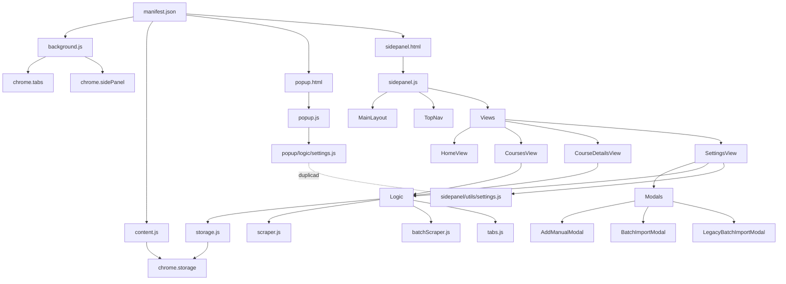

# 🔍 Auditoria Arquitetural - Extensão UNIVESP

**Data da Análise:** 11 de Dezembro de 2025  
**Versão Atual:** 2.3.0  
**Total de Arquivos:** ~2.946 linhas de código (JS + HTML + CSS)

---

## 📊 Resumo Executivo

Esta auditoria analisa a arquitetura do projeto sem modificar código, focando em:
- Estrutura de pastas e organização modular
- Stack tecnológica e dependências
- Cobertura e qualidade dos testes
- Tamanho e complexidade dos arquivos
- Relacionamento entre componentes e orquestradores

### ✅ Pontos Fortes Identificados
- ✔️ **Testes funcionando**: 21 testes passando (4 suítes)
- ✔️ **Separação de responsabilidades**: Lógica, Views, Componentes e Utils bem separados
- ✔️ **Modularização**: Uso de ES6 modules com imports/exports
- ✔️ **Manifest V3**: Uso da versão mais recente do Chrome Extensions

### ⚠️ Áreas de Melhoria Críticas
- 🔴 **Arquivo muito grande**: `SettingsView.js` (245 linhas)
- 🔴 **CSS monolítico**: `sidepanel.css` (535 linhas)
- 🔴 **Falta de testes E2E**: Apenas testes unitários
- 🔴 **Estrutura de pastas inconsistente**: Popup vs Sidepanel
- 🔴 **Duplicação de código**: `settings.js` duplicado em popup e sidepanel

---

## 🏗️ 1. Arquitetura de Pastas

### 📁 Estrutura Atual

```
extensaoUNIVESP/
├── manifest.json              # Orquestrador principal
├── package.json               # Configuração do projeto
├── assets/                    # Recursos estáticos
├── popup/                     # Interface do popup
│   ├── popup.html            # 46 linhas
│   ├── popup.css             # 112 linhas
│   ├── popup.js              # 94 linhas
│   └── logic/
│       └── settings.js       # 58 linhas [DUPLICADO]
├── sidepanel/                 # Interface do painel lateral
│   ├── sidepanel.html        # 13 linhas
│   ├── sidepanel.css         # 535 linhas ⚠️
│   ├── sidepanel.js          # 91 linhas
│   ├── components/           # Componentes reutilizáveis
│   │   ├── Layout/
│   │   │   ├── MainLayout.js    # 44 linhas
│   │   │   └── TopNav.js        # 46 linhas
│   │   └── Modals/
│   │       ├── Modal.js              # 75 linhas
│   │       ├── AddManualModal.js     # 64 linhas
│   │       ├── BatchImportModal.js   # 147 linhas
│   │       └── LegacyBatchImportModal.js # 155 linhas
│   ├── views/                # Views (Telas)
│   │   ├── HomeView.js           # 40 linhas
│   │   ├── CoursesView.js        # 56 linhas
│   │   ├── CourseDetailsView.js  # 124 linhas
│   │   └── SettingsView.js       # 245 linhas ⚠️
│   ├── logic/                # Lógica de negócio
│   │   ├── storage.js       # 121 linhas
│   │   ├── scraper.js       # 129 linhas
│   │   ├── batchScraper.js  # 174 linhas
│   │   └── tabs.js          # 30 linhas
│   ├── ui/
│   │   └── components.js    # 83 linhas
│   └── utils/
│       ├── settings.js           # 58 linhas [DUPLICADO]
│       └── legacy_batchScraper.js # 113 linhas [LEGADO?]
├── scripts/                  # Service Worker e Content Scripts
│   ├── background.js         # 38 linhas
│   └── content.js            # 39 linhas
└── tests/                    # Testes unitários
    ├── imports.test.js       # 46 linhas
    ├── logic.test.js         # 46 linhas
    ├── tabs.test.js          # 64 linhas
    └── batchScraper.test.js  # 60 linhas
```

### 🔴 Problemas Arquiteturais Identificados

#### 1.1 Inconsistência Estrutural: Popup vs Sidepanel

**Problema:**
- `popup/` tem estrutura simples: `logic/settings.js`
- `sidepanel/` tem estrutura complexa: `components/`, `views/`, `logic/`, `ui/`, `utils/`

**Impacto:** Dificulta manutenção e navegação no projeto.

**Sugestão:**
```diff
popup/
├── popup.html
├── popup.css
├── popup.js
+ ├── components/     # Extrair componentes se necessário
+ ├── utils/          # Mover settings.js para cá
- └── logic/
-     └── settings.js
```

#### 1.2 Duplicação de Código: `settings.js`

**Localização:**
- `/popup/logic/settings.js` (58 linhas)
- `/sidepanel/utils/settings.js` (58 linhas)

**Problema:** Código duplicado = manutenção duplicada.

**Sugestão:** Criar pasta `shared/` ou `common/` na raiz:
```
shared/
└── utils/
    └── settings.js
```

#### 1.3 Código Legado Não Removido

**Arquivo:** `/sidepanel/utils/legacy_batchScraper.js` (113 linhas)

**Problema:** 
- Nome indica código legado
- Existe `logic/batchScraper.js` como versão atual
- Mantém código morto no projeto

**Sugestão:** 
- Verificar se está realmente em uso
- Remover ou documentar motivo da manutenção

#### 1.4 Sobrecarga de Responsabilidades: `ui/components.js`

**Problema:**
- Existe pasta `components/` com componentes organizados
- Existe arquivo `ui/components.js` com função similar
- Confusão sobre onde colocar novos componentes

**Sugestão:** Consolidar em uma única localização.

---

## 🎨 2. Análise de CSS

### 📏 Tamanho dos Arquivos CSS

| Arquivo | Linhas | Tamanho | Status |
|---------|--------|---------|--------|
| `sidepanel/sidepanel.css` | **535** | 8.5KB | 🔴 Crítico |
| `popup/popup.css` | 112 | 1.8KB | ✅ OK |

### 🔴 Problema: CSS Monolítico

**Análise do `sidepanel.css`:**

```css
/* Estrutura atual (tudo em um arquivo) */
- Layout Structure (linhas 1-24)
- Top Navigation (linhas 26-59)
- Home Dashboard Styles (linhas 61-167)
- Config Section (linhas 168-267)
- Footer Info (linhas 269-287)
- Course Legend (linhas 298-322)
- Item List (linhas 323-398)
- Forms (linhas 399-421)
- Details View (linhas 423-494)
- Weeks Container (linhas 495-528)
- Settings View (linhas 530-536)
```

**Problemas:**
1. **Difícil manutenção**: 535 linhas para encontrar um estilo específico
2. **Especificidade não clara**: Classes globais podem conflitar
3. **Sem reutilização**: Estilos não componentizados
4. **Performance**: Carrega estilos não usados em todas as views

### 💡 Sugestões de Refatoração

#### Opção 1: CSS Modules (Recomendado)
```
sidepanel/
├── styles/
│   ├── global.css         # Reset e variáveis
│   ├── layout.css         # Grid e estrutura
│   ├── components/
│   │   ├── nav.css
│   │   ├── card.css
│   │   ├── modal.css
│   │   └── button.css
│   └── views/
│       ├── home.css
│       ├── courses.css
│       └── settings.css
```

#### Opção 2: CSS-in-JS (Para futura migração)
- Considerar se migrar para framework (React, Vue)
- Estilos co-localizados com componentes

#### Opção 3: Metodologia BEM
- Manter arquivo único, mas organizar com BEM
- Exemplo: `.nav-item`, `.nav-item--active`, `.nav-item__icon`

---

## 📝 3. Análise de JavaScript

### 📊 Distribuição de Tamanho de Arquivos

| Arquivo | Linhas | Complexidade | Status |
|---------|--------|--------------|--------|
| `SettingsView.js` | **245** | Alta | 🔴 Muito Grande |
| `batchScraper.js` | 174 | Alta | 🟡 Grande |
| `LegacyBatchImportModal.js` | 155 | Média | 🟡 Grande |
| `BatchImportModal.js` | 147 | Média | 🟡 Grande |
| `scraper.js` | 129 | Média | ✅ OK |
| `CourseDetailsView.js` | 124 | Média | ✅ OK |
| `storage.js` | 121 | Baixa | ✅ OK |
| `legacy_batchScraper.js` | 113 | Média | ⚠️ Legado |

### 🔴 Arquivo Crítico: `SettingsView.js` (245 linhas)

**Análise da Estrutura:**

```javascript
class SettingsView {
  constructor()         // 15 linhas - Setup inicial
  render()              // 70 linhas - 🔴 Renderização enorme
  afterRender()         // 30 linhas - Event listeners
  setupConfigLogic()    // 61 linhas - 🔴 Lógica complexa
  handleAddCurrent()    // 40 linhas - 🔴 Handler grande
  showFeedback()        // 13 linhas - ✅ OK
}
```

**Problemas Identificados:**

1. **Método `render()` muito grande (70 linhas)**
   - Retorna HTML como string gigante
   - Mistura estrutura com lógica de montagem
   - Difícil de testar

2. **Método `setupConfigLogic()` faz demais (61 linhas)**
   - Gerencia RA
   - Gerencia Domain
   - Lida com feedback
   - Devia ser 3+ métodos separados

3. **Método `handleAddCurrent()` complexo (40 linhas)**
   - Lógica de scraping
   - Manipulação de tabs
   - Adiciona item
   - Mostra feedback
   - Navegação

### 💡 Sugestão de Refatoração para `SettingsView.js`

```javascript
// Extrair para arquivos separados:

// 1. sidepanel/components/Forms/ConfigForm.js
class ConfigForm {
  renderRaInput() {}
  renderDomainInput() {}
  renderSaveButton() {}
}

// 2. sidepanel/logic/raManager.js
export function saveRa(ra) {}
export function loadRa() {}

// 3. sidepanel/logic/domainManager.js
export function saveDomain(domain) {}
export function loadDomain() {}
export function resetToDefault() {}

// 4. sidepanel/utils/feedback.js
export function showFeedback(message, type) {}

// 5. SettingsView.js (reduzido para ~80 linhas)
import { ConfigForm } from '../components/Forms/ConfigForm.js';
import { saveRa, loadRa } from '../logic/raManager.js';
import { saveDomain, loadDomain, resetToDefault } from '../logic/domainManager.js';
import { showFeedback } from '../utils/feedback.js';

class SettingsView {
  constructor(callbacks) {}
  render() { /* Usa ConfigForm */ }
  afterRender() { /* Apenas setup de listeners */ }
  handleRaSave() { /* Usa raManager */ }
  handleDomainSave() { /* Usa domainManager */ }
  handleAddCurrent() { /* Simplificado */ }
}
```

**Benefícios:**
- ✅ Cada arquivo com responsabilidade única
- ✅ Fácil de testar cada módulo isoladamente
- ✅ Reutilização de código (raManager pode ser usado em popup)
- ✅ Arquivo principal reduzido de 245 → ~80 linhas

---

## 🧪 4. Análise de Testes

### 📊 Cobertura Atual

**Testes Existentes:**
```
✅ tests/imports.test.js       - 13 testes (verificação de arquivos)
✅ tests/logic.test.js         - 2 testes (scraper básico)
✅ tests/tabs.test.js          - 3 testes (navegação de tabs)
✅ tests/batchScraper.test.js  - 3 testes (batch scraping)
```

**Total:** 21 testes passando ✅

### 🔴 Problemas Identificados

#### 4.1 Falta de Testes para Módulos Críticos

| Módulo | Linhas | Testes | Cobertura Estimada |
|--------|--------|--------|-------------------|
| `storage.js` | 121 | ❌ 0 | 0% |
| `SettingsView.js` | 245 | ❌ 0 | 0% |
| `CoursesView.js` | 56 | ❌ 0 | 0% |
| `CourseDetailsView.js` | 124 | ❌ 0 | 0% |
| `scraper.js` | 129 | ✅ 2 | ~15% |
| `batchScraper.js` | 174 | ✅ 3 | ~20% |

**Cobertura Estimada Total: < 25%** 🔴

#### 4.2 Ausência de Testes E2E

**Problema:** 
- Apenas testes unitários com mocks
- Nenhum teste de fluxo completo
- Nenhum teste de interação de usuário

**Impacto:**
- Bugs em integração não detectados
- Confiança baixa em deploys
- Regressões não capturadas

#### 4.3 Testes Não Testam Casos de Erro

**Exemplo em `storage.test.js` (não existe):**
```javascript
// Casos não testados:
- O que acontece se chrome.storage falhar?
- O que acontece ao adicionar item duplicado?
- O que acontece ao deletar item inexistente?
- O que acontece com dados corrompidos?
```

### 💡 Recomendações de Testes

#### 1. Criar Testes Unitários Faltantes

```
tests/
├── unit/
│   ├── storage.test.js          # 🆕 Testar CRUD completo
│   ├── scraper.test.js          # ✅ Expandir existente
│   ├── batchScraper.test.js     # ✅ Expandir existente
│   ├── tabs.test.js             # ✅ Expandir existente
│   ├── raManager.test.js        # 🆕 Após refatoração
│   └── domainManager.test.js    # 🆕 Após refatoração
```

#### 2. Criar Testes de Integração

```
tests/
├── integration/
│   ├── addCourse.test.js        # Fluxo: Adicionar curso completo
│   ├── scrapeCourse.test.js     # Fluxo: Scraping + Storage
│   ├── batchImport.test.js      # Fluxo: Import múltiplo
│   └── navigation.test.js       # Fluxo: Navegação entre views
```

#### 3. Criar Testes E2E com Puppeteer

```
tests/
├── e2e/
│   ├── popup.e2e.test.js        # 🆕 Teste popup completo
│   ├── sidepanel.e2e.test.js    # 🆕 Teste sidepanel completo
│   ├── contentScript.e2e.test.js # 🆕 Teste autofill SEI
│   └── helpers/
│       └── loadExtension.js
```

**Exemplo de teste E2E:**
```javascript
// tests/e2e/sidepanel.e2e.test.js
import puppeteer from 'puppeteer';

describe('Side Panel E2E', () => {
  it('deve adicionar curso e navegar para detalhes', async () => {
    const browser = await puppeteer.launch({
      headless: false,
      args: [
        '--disable-extensions-except=./extensaoUNIVESP',
        '--load-extension=./extensaoUNIVESP'
      ]
    });
    
    // ... teste completo de fluxo
  });
});
```

#### 4. Configurar Coverage Report

**Adicionar ao `package.json`:**
```json
{
  "scripts": {
    "test": "jest",
    "test:coverage": "jest --coverage",
    "test:watch": "jest --watch",
    "test:e2e": "jest --config=jest.e2e.config.js"
  },
  "jest": {
    "coverageThreshold": {
      "global": {
        "branches": 80,
        "functions": 80,
        "lines": 80,
        "statements": 80
      }
    }
  }
}
```

---

## 🔧 5. Análise do `manifest.json`

### 📄 Configuração Atual

```json
{
  "manifest_version": 3,
  "name": "AutoPreencher UNIVESP",
  "version": "2.3.0",
  "permissions": ["storage", "sidePanel", "scripting", "tabs", "activeTab"],
  "background": { "service_worker": "scripts/background.js" },
  "host_permissions": ["https://sei.univesp.br/*", "https://ava.univesp.br/*"],
  "side_panel": { "default_path": "sidepanel/sidepanel.html" },
  "action": { "default_popup": "popup/popup.html" },
  "content_scripts": [{ "matches": ["https://sei.univesp.br/*"], "js": ["scripts/content.js"] }]
}
```

### ✅ Pontos Positivos

1. ✔️ **Manifest V3**: Versão mais recente
2. ✔️ **Permissões mínimas**: Apenas o necessário
3. ✔️ **Host permissions específicos**: Apenas domínios UNIVESP
4. ✔️ **Service Worker**: Background script moderno

### 🟡 Melhorias Sugeridas

#### 5.1 Adicionar Ícones Diferentes por Tamanho

**Problema:** Todos os tamanhos apontam para o mesmo ícone.

```json
"action": {
  "default_icon": {
    "16": "assets/icon.png",   // ⚠️ Mesmo arquivo
    "48": "assets/icon.png",   // ⚠️ Mesmo arquivo
    "128": "assets/icon.png"   // ⚠️ Mesmo arquivo
  }
}
```

**Sugestão:**
```json
"action": {
  "default_icon": {
    "16": "assets/icon-16.png",
    "48": "assets/icon-48.png",
    "128": "assets/icon-128.png"
  }
}
```

#### 5.2 Adicionar Web Accessible Resources

**Problema:** Se o content script precisar injetar CSS/JS, pode falhar.

**Sugestão:**
```json
"web_accessible_resources": [{
  "resources": ["assets/*"],
  "matches": ["https://sei.univesp.br/*", "https://ava.univesp.br/*"]
}]
```

#### 5.3 Adicionar Content Security Policy

**Sugestão:**
```json
"content_security_policy": {
  "extension_pages": "script-src 'self'; object-src 'self'"
}
```

#### 5.4 Adicionar Metadata Opcional

```json
"author": "Gerson Santiago",
"homepage_url": "https://github.com/Gerson-Santiago/extensaoUNIVESP"
```

---

## 📦 6. Análise do `package.json`

### 📄 Configuração Atual

```json
{
  "name": "univesp-extension",
  "version": "2.3.0",
  "scripts": { "test": "jest" },
  "devDependencies": {
    "@babel/preset-env": "^7.24.0",
    "babel-jest": "^29.7.0",
    "jest": "^29.7.0",
    "jest-environment-jsdom": "^29.7.0"
  }
}
```

### 🔴 Problemas Identificados

#### 6.1 Falta de Scripts de Desenvolvimento

**Problema:** Apenas script `test`.

**Sugestão:**
```json
"scripts": {
  "test": "jest",
  "test:coverage": "jest --coverage",
  "test:watch": "jest --watch",
  "lint": "eslint .",
  "lint:fix": "eslint . --fix",
  "format": "prettier --write .",
  "build": "npm run lint && npm test",
  "dev": "npm run lint && npm test -- --watch"
}
```

#### 6.2 Ausência de Linting

**Problema:** Sem ESLint configurado.

**Sugestão:**
```bash
npm install --save-dev eslint eslint-plugin-chrome-extensions
```

**Adicionar `.eslintrc.json`:**
```json
{
  "env": {
    "browser": true,
    "es2021": true,
    "webextensions": true
  },
  "extends": "eslint:recommended",
  "parserOptions": {
    "ecmaVersion": "latest",
    "sourceType": "module"
  },
  "rules": {
    "no-unused-vars": "warn",
    "no-console": ["warn", { "allow": ["warn", "error"] }]
  }
}
```

#### 6.3 Ausência de Prettier

**Sugestão:**
```bash
npm install --save-dev prettier
```

**Adicionar `.prettierrc`:**
```json
{
  "semi": true,
  "trailingComma": "es5",
  "singleQuote": true,
  "printWidth": 100,
  "tabWidth": 2
}
```

#### 6.4 Falta de Validação Pre-commit

**Sugestão:**
```bash
npm install --save-dev husky lint-staged
```

**Adicionar ao `package.json`:**
```json
"lint-staged": {
  "*.js": ["eslint --fix", "prettier --write"],
  "*.css": ["prettier --write"],
  "*.md": ["prettier --write"]
},
"husky": {
  "hooks": {
    "pre-commit": "lint-staged",
    "pre-push": "npm test"
  }
}
```

---

## 🔗 7. Relacionamento entre Componentes

### 🗺️ Mapa de Dependências



### 🔴 Problemas de Acoplamento

#### 7.1 `SettingsView` Muito Acoplado

**Dependências:**
```javascript
import { AddManualModal } from '../components/Modals/AddManualModal.js';
import { BatchImportModal } from '../components/Modals/BatchImportModal.js';
import { addItem, clearItems } from '../logic/storage.js';
import { scrapeWeeksFromTab } from '../logic/scraper.js';
import { formatEmail, extractRa, resolveDomain, CONSTANTS } from '../utils/settings.js';
```

**Problema:** 5 dependências diretas = alto acoplamento.

**Sugestão:** Usar padrão Mediator ou Event Bus:
```javascript
// eventBus.js
export const eventBus = {
  on(event, callback) {},
  emit(event, data) {},
  off(event, callback) {}
};

// SettingsView.js
import { eventBus } from '../utils/eventBus.js';

class SettingsView {
  handleAddCurrent() {
    eventBus.emit('course:add', { name, url });
  }
}

// storage.js
eventBus.on('course:add', (data) => {
  addItem(data.name, data.url);
});
```

#### 7.2 Duplicação de `settings.js`

**Diagrama de Duplicação:**
```
popup/logic/settings.js
         ↓
    [DUPLICADO]
         ↓
sidepanel/utils/settings.js
```

**Impacto:**
- Bug fix precisa ser aplicado em 2 lugares
- Inconsistência entre popup e sidepanel
- Código duplicado = manutenção duplicada

**Solução:**
```
shared/
└── utils/
    └── settings.js  ← Única fonte de verdade
         ↑
         ├── popup.js
         └── SettingsView.js
```

---

## 📈 8. Métricas de Qualidade

### Complexidade Ciclomática Estimada

| Arquivo | Funções | Complexidade | Classificação |
|---------|---------|--------------|---------------|
| `SettingsView.js` | 6 | Alta (>15) | 🔴 Crítico |
| `batchScraper.js` | 2 | Alta (>10) | 🟡 Atenção |
| `scraper.js` | 2 | Média (5-10) | ✅ OK |
| `storage.js` | 7 | Baixa (<5) | ✅ Excelente |

### Acoplamento de Módulos

| Módulo | Dependências | Fan-in | Fan-out | Status |
|--------|--------------|--------|---------|--------|
| `storage.js` | 0 | 5 | 0 | ✅ Baixo acoplamento |
| `SettingsView.js` | 5 | 1 | 5 | 🔴 Alto acoplamento |
| `scraper.js` | 0 | 3 | 0 | ✅ Baixo acoplamento |
| `sidepanel.js` | 4 | 0 | 4 | 🟡 Médio acoplamento |

**Legenda:**
- **Fan-in:** Quantos módulos dependem deste
- **Fan-out:** De quantos módulos este depende

---

## 🎯 9. Plano de Ação Prioritário

### 🔥 Prioridade ALTA (Fazer Primeiro)

#### 1. Consolidar `settings.js` Duplicado
- **Impacto:** Alto
- **Esforço:** Baixo
- **Ação:**
  1. Criar pasta `shared/utils/`
  2. Mover um dos `settings.js` para lá
  3. Atualizar imports em `popup.js` e `SettingsView.js`

#### 2. Adicionar ESLint e Prettier
- **Impacto:** Alto
- **Esforço:** Baixo
- **Ação:**
  1. `npm install --save-dev eslint prettier`
  2. Configurar `.eslintrc.json` e `.prettierrc`
  3. Executar `npm run lint:fix` e `npm run format`

#### 3. Criar Testes para `storage.js`
- **Impacto:** Alto (módulo crítico sem testes)
- **Esforço:** Médio
- **Ação:**
  1. Criar `tests/unit/storage.test.js`
  2. Testar todas as 7 funções exportadas
  3. Incluir casos de erro

### 🟡 Prioridade MÉDIA (Fazer em Seguida)

#### 4. Refatorar `SettingsView.js`
- **Impacto:** Alto
- **Esforço:** Alto
- **Ação:**
  1. Extrair `ConfigForm` component
  2. Criar `raManager.js` e `domainManager.js`
  3. Criar `feedback.js` utility
  4. Reduzir classe para ~80 linhas

#### 5. Modularizar `sidepanel.css`
- **Impacto:** Médio
- **Esforço:** Médio
- **Ação:**
  1. Criar pasta `sidepanel/styles/`
  2. Separar em: `layout.css`, `components/`, `views/`
  3. Importar em `sidepanel.html` na ordem correta

#### 6. Remover ou Documentar Código Legado
- **Impacto:** Médio
- **Esforço:** Baixo
- **Ação:**
  1. Verificar uso de `legacy_batchScraper.js`
  2. Se não usado: deletar
  3. Se usado: documentar motivo e plano de migração

### 🟢 Prioridade BAIXA (Melhorias Futuras)

#### 7. Implementar Testes E2E
- **Impacto:** Alto (longo prazo)
- **Esforço:** Alto
- **Ação:**
  1. Adicionar Puppeteer ou Playwright
  2. Criar testes para fluxos principais
  3. Integrar no CI/CD

#### 8. Adicionar CI/CD
- **Impacto:** Médio
- **Esforço:** Médio
- **Ação:**
  1. Criar `.github/workflows/test.yml`
  2. Executar testes em cada PR
  3. Gerar coverage report

#### 9. Migrar para TypeScript
- **Impacto:** Alto (longo prazo)
- **Esforço:** Muito Alto
- **Ação:**
  1. Adicionar TypeScript gradualmente
  2. Começar por `storage.js` (mais simples)
  3. Migrar módulo por módulo

---

## 📊 10. Resumo de Recomendações

### Arquitetura de Pastas
```diff
+ ✅ Criar pasta shared/ para código comum
+ ✅ Mover settings.js duplicado para shared/utils/
+ ✅ Consolidar components/ (remover ui/components.js)
- ❌ Remover legacy_batchScraper.js (se não usado)
+ ✅ Organizar tests/ em unit/, integration/, e2e/
```

### Stack Tecnológica
```diff
+ ✅ Adicionar ESLint
+ ✅ Adicionar Prettier
+ ✅ Adicionar Husky + lint-staged
+ ✅ Adicionar Chrome Types para autocomplete
~ 🔄 Considerar TypeScript (longo prazo)
~ 🔄 Considerar framework (React/Vue) (longo prazo)
```

### Testes
```diff
+ ✅ Criar tests/unit/storage.test.js
+ ✅ Criar tests/unit/raManager.test.js
+ ✅ Criar tests/integration/
+ ✅ Adicionar coverage threshold (80%)
+ ✅ Criar tests/e2e/ com Puppeteer
+ ✅ Expandir testes existentes com casos de erro
```

### Refatoração de Código
```diff
+ ✅ Dividir SettingsView.js (245 → 80 linhas)
+ ✅ Modularizar sidepanel.css (535 → múltiplos arquivos)
+ ✅ Extrair logic de SettingsView para managers
+ ✅ Criar eventBus para desacoplar módulos
```

### Manifest e Configuração
```diff
+ ✅ Criar ícones em múltiplos tamanhos
+ ✅ Adicionar web_accessible_resources
+ ✅ Adicionar content_security_policy
+ ✅ Adicionar author e homepage_url
```

---

## 🏆 Conclusão

### Estado Atual: ⭐⭐⭐☆☆ (3/5)

**Pontos Fortes:**
- ✅ Testes básicos funcionando
- ✅ Modularização presente
- ✅ Separação de responsabilidades inicial
- ✅ Uso de ES6 modules

**Áreas Críticas:**
- 🔴 Arquivos muito grandes (SettingsView, CSS)
- 🔴 Código duplicado (settings.js)
- 🔴 Cobertura de testes baixa (<25%)
- 🔴 Falta de linting e formatação

### Estado Futuro Desejado: ⭐⭐⭐⭐⭐ (5/5)

**Após implementar as recomendações:**
- ✅ Arquitetura consolidada e consistente
- ✅ Código sem duplicação
- ✅ Cobertura de testes >80%
- ✅ Linting e formatação automática
- ✅ CI/CD configurado
- ✅ Arquivos com responsabilidade única
- ✅ CSS modularizado e reutilizável

### Próximos Passos Sugeridos

1. **Semana 1-2:** Prioridade ALTA (itens 1-3)
2. **Semana 3-4:** Prioridade MÉDIA (itens 4-6)
3. **Mês 2+:** Prioridade BAIXA (itens 7-9)

---

**Auditoria realizada por:** Antigravity AI  
**Método:** Análise estática sem modificação de código  
**Objetivo:** Identificar melhorias arquiteturais e técnicas
