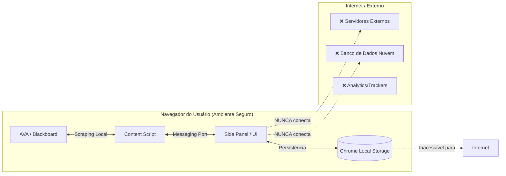

# 🛡️ Protocolo de Arquitetura Técnica & Privacidade

**Versão do Documento:** 1.0  
**Aplica-se a:** Extensão UNIVESP (v2.3.0+)  
**Classificação:**  Ferramenta de Produtividade & Organização Pessoal (Productivity Tool)

---

## 🔒 Declaração de Privacidade e Soberania de Dados

### 1. AUSÊNCIA DE BANCO DE DADOS EXTERNO ("No External Database")
Esta extensão opera sob uma arquitetura estrita de **"First-Party / Local-Only"**. 
*   **Não existe servidor backend** proprietário da extensão coletando dados.
*   **Não existe banco de dados em nuvem** (como Firebase, AWS, MongoDB Atlas, etc).
*   **Zero Telemetria:** Nenhuma informação de uso, cliques ou navegação é enviada para terceiros.

### 2. Armazenamento Local (Client-Side Storage)
Todos os dados persistidos pela extensão residem **exclusivamente no dispositivo do usuário**,
└─ 💾 DATA LAYER
   └─ Chrome Storage (Sync/Local) (utilizando a [Chrome Storage API](https://developer.chrome.com/docs/extensions/reference/api/storage)).
*   **Dados Salvos:** IDs de cursos, links de favoritos e configurações do usuário (ex: RA).
*   **Localização:** `chrome.storage.sync` (Sincronização criptografada via conta Google do usuário) ou `chrome.storage.local` (Sandbox local).
*   **Controle:** Se o usuário desinstalar a extensão, os dados locais são apagados. Dados sincronizados permanecem na conta Google do usuário até serem limpos manualmente, mas inacessíveis a terceiros.

---

## 🏗️ Arquitetura Técnica: Produtividade & Organização

A extensão foi desenhada juridicamente e tecnicamente como uma **camada de organização visual** sobre o sistema acadêmico existente, sem alterar ou interceptar dados críticos de forma maliciosa.

### Diagrama de Fluxo de Dados (Data Flow)



### Componentes de Segurança

#### 1. Permissões Restritas (Least Privilege Principle)
O arquivo `manifest.json` audita e garante que a extensão só tem permissão de operar em domínios oficiais da instituição:
```json
"host_permissions": [
  "https://sei.univesp.br/*",
  "https://ava.univesp.br/*"
]
```
Qualquer tentativa de enviar dados para outro domínio (ex: `google.com` ou um servidor hacker) seria **bloqueada nativamente pelo navegador**, pois não consta na lista de permissões.

#### 2. Autenticação Transparente
A extensão **não realiza login**. Ela utiliza a sessão já autenticada pelo usuário no navegador.
*   Se o usuário não estiver logado no AVA, a extensão simplesmente não funciona (não carrega dados).
*   A extensão não tem acesso a senhas, pois atua apenas *após* o login (Post-Auth Productivity Layer).

---

## ⚡ Funcionalidade: Organização de Links

O motor principal da extensão (`batchScraper.js` e `scraper.js`) atua como um **"Indexador Pessoal"**.

1.  **Leitura (Read-Only):** A extensão lê o DOM (Document Object Model) da página que o usuário está visitando para identificar nomes de disciplinas e links de semanas.
2.  **Organização:** Cria um índice visual (Side Panel) para facilitar o clique.
3.  **Ação:** Ao clicar, a extensão apenas redireciona o usuário para o link oficial.

**Analogia Técnica:** A extensão funciona como um "Favoritos" (Bookmarks) automatizado e dinâmico, organizando links que já estão públicos para o aluno, mas de forma desordenada no layout original.

---

## ✅ Resumo para Compliance / Auditoria

| Quesito | Status | Detalhe Técnico |
| :--- | :--- | :--- |
| **Banco de Dados Externo** | ❌ NÃO POSSUI | Dados em `chrome.storage.sync` (Nuvem pessoal Google) ou `local`. |
| **Envio de Dados (Upload)** | ❌ NÃO REALIZA | Nenhuma requisição `POST`/`PUT` para fora do domínio UNIVESP. |
| **Coleta de Senhas** | ❌ NÃO REALIZA | Utiliza cookies de sessão existentes do browser. |
| **Rastreamento (Tracking)** | ❌ NÃO POSSUI | Sem Google Analytics, Mixpanel ou similares. |
| **Propósito** | ✅ PRODUTIVIDADE | Organização de UI/UX para eficiência do aluno. |

---

*Documento gerado automaticamente com base na análise estática do código-fonte (Source Code Analysis) da versão 2.3.0.*
