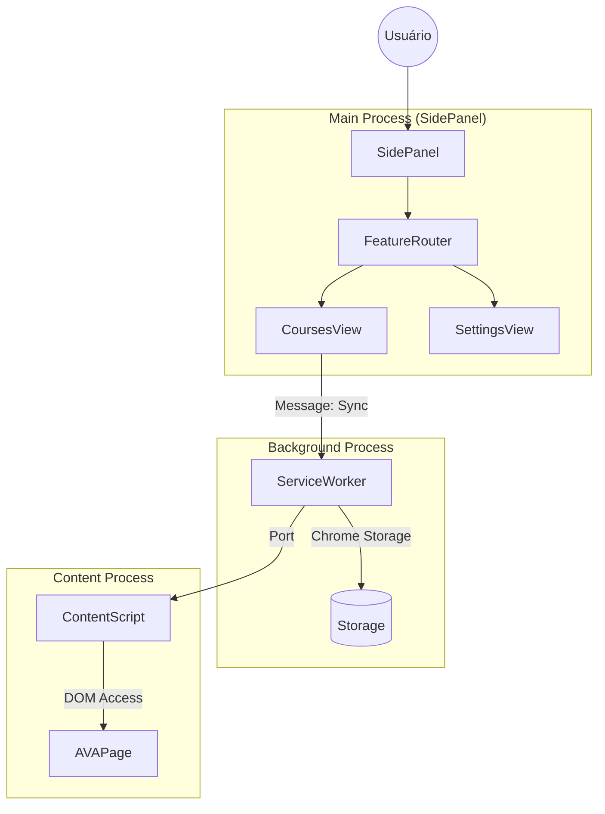

# Especificação de Arquitetura

> **Status**: Produção (v2.8.0)
> **Padrão**: Screaming Architecture (Domain-Driven)
> **Runtime**: Google Chrome V3

Este documento define a arquitetura de software, restrições técnicas e decisões de design do projeto.

---

## 1. Princípios Arquiteturais

### 1.1 Screaming Architecture
A organização do código deve evidenciar o domínio de negócio, não o framework.
- **Regra**: O diretório `features/` é a fonte da verdade. Cada subdiretório representa um Bounded Context.
- **Isolamento**: Features não devem acoplar-se diretamente. Comunicação via Eventos ou Shared Kernel é preferível.

### 1.2 Local-First (Data Sovereignty)
O sistema opera sem backend proprietário.
- **Persistência**: Exclusivamente via `chrome.storage` (Sync/Local).
- **Semântica**: O usuário é soberano sobre seus dados. Não há telemetria externa ou database central.

### 1.3 Minimalist Runtime
- **Zero Frameworks**: Interface construída com Web Components padrões ou Vanilla JS para maximizar performance e longevidade.
- **Buildless Dev**: O código fonte é ES Modules nativo, capaz de rodar diretamente no navegador (exceto para JSX/TS se introduzidos, mas atualmente Vanilla).

---

## 2. Anatomia do Sistema (Manifest V3)

### 2.1 Componentes do Chrome Extension
| Componente | Contexto | Responsabilidade |
| :--- | :--- | :--- |
| **Background SW** | Service Worker | Orquestração de eventos, Persistência, Mensageria. |
| **Side Panel** | Main UI Thread | Interface principal. Hospeda as `Views` das features. |
| **Content Script** | Isolated World | Interação com DOM do AVA/SEI (Scraping, Autofill). |
| **Popup** | UI Thread | Acesso rápido (Legacy/Fallback). |

### 2.2 Estrutura de Diretórios (Canonical)
A estrutura física reflete a lógica de negócio:

```text
extensaoUNIVESP/
├── assets/              # Recursos Estáticos
├── features/            # Domínios de Negócio (Bounded Contexts)
│   ├── courses/         # Gestão Acadêmica
│   ├── session/         # Auth & Credenciais
│   └── settings/        # Configuração Global
├── shared/              # Shared Kernel (Reutilizáveis)
│   ├── logic/           # Business Logic agnóstica
│   ├── ui/              # Dumb Components (Modal, Button)
│   └── utils/           # Low-level helpers (Browser API)
├── scripts/             # Background & Content Scripts
└── sidepanel/           # Entry Point da UI (Shell)
```

---

## 3. Camadas de Software

### 3.1 Domain Layer (`features/*/logic`)
Contém a lógica pura de negócio.
- **Característica**: Agnóstica de Framework e UI.
- **Teste**: 100% Coberta por Testes Unitários.

### 3.2 Service Layer (`features/*/services`)
Responsável pela orquestração e integração com o mundo externo (DOM, APIs).
- **Pattern**: Facade / Service Object.
- **Responsabilidade**: Isolar a View da complexidade de obtenção de dados.

### 3.3 Repository Layer (`features/*/repository`)
Responsável pela persistência e recuperação de dados. Implementa o padrão Repository para abstrair a fonte de dados (ex: `chrome.storage` ou API).
- **Pattern**: Repository Pattern.
- **Responsabilidade**: CRUD puro, sem regras de negócio complexas.
- **Exemplo**: `ActivityProgressRepository.js`.

### 3.4 Model Layer (`features/*/models`)
Definições de tipos e entidades de domínio.
- **Formato**: Módulos ES contendo JSDoc `@typedef`.
- **Regra**: Fonte única da verdade para estruturas de dados (Canonical Models).
- **Exemplo**: `Week.js`, `ActivityProgress.js`.

### 3.5 Interface Layer (`features/*/ui`)
Responsável pela renderização e interação.
- **Componentes**: Views (Páginas) e Components (Widgets).
- **Estado**: Gerenciamento local ou via Stores simples.

### 3.6 Infrastructure Layer (`scripts/`)
Conecta o sistema à API do navegador.
- **Responsabilidade**: Mensageria entre abas, detecção de lifecycle eventos.

---

## 4. Decisões Técnicas (ADR Summary)

### ADR-001: Vanilla JS vs Frameworks
**Decisão:** Uso de Vanilla JS + ES Modules.
**Motivo:** Reduzir complexidade de build, eliminar "peso morto" de bundles, garantir compatibilidade perene com V8.

### ADR-002: Side Panel como UI Principal
**Decisão:** Migração de Popup para Side Panel.
**Motivo:** Permitir uso concomitante da extensão enquanto navega no AVA (Multitasking).

---

## 5. Mapa de Comunicação


