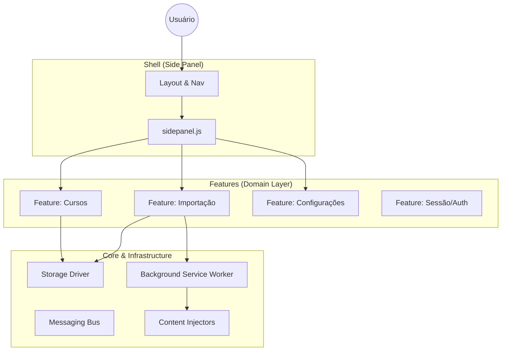

# 🏗️ Especificação de Arquitetura e Tecnologia

> **Status**: Produção (v2.6.1)
> **Arquitetura**: Screaming Architecture (Domain-Driven)
> **Plataforma**: Google Chrome Extensions (Manifest V3)

Este documento atua como a **Fonte da Verdade Arquitetural** do projeto. Ele define as restrições, padrões e fronteiras que garantem a longevidade e manutenibilidade do software.

---

## 1. Princípios Arquiteturais (The Axioms)

### 1.1 Screaming Architecture (A Arquitetura que Grita)
A estrutura de diretórios do projeto reflete **o que o sistema faz**, não de que o sistema é feito.
*   **Intenção > Ferramenta**: Ao abrir a raiz do projeto, um desenvolvedor deve ver *Casos de Uso* (Cursos, Importação), não *Frameworks* (Controllers, Views).
*   **Regra**: Se uma nova funcionalidade de negócio for adicionada, uma nova pasta em `features/` deve nascer.

### 1.2 Local-First & Zero-Backend
O sistema opera sob o princípio de soberania de dados do usuário.
*   **Persistência**: Todo dado reside estritamente no `chrome.storage` local.
*   **Sincronização**: Ocorre apenas através do mecanismo nativo do Chrome (Google Account), sem servidores intermediários proprietários.
*   **Offline-Capable**: A lógica de negócio independe de conectividade constante, salvo para operações de scraping (AVA/SEI).

### 1.3 Dependências Mínimas (Vanilla First)
A longevidade do projeto é priorizada sobre a conveniência imediata.
*   **Sem Frameworks de UI**: Uso de HTML/CSS/JS nativos e Custom Elements (se necessário) para evitar *framework fatigue* e obsolescência.
*   **Sem Transpilação em Runtime**: O código em produção é ES Modules nativo, suportado diretamente pela V8 engine moderna.

---

## 2. Anatomia do Sistema (Manifest V3)

O sistema é dividido em três camadas concêntricas de responsabilidade.

### 2.1 Camada de Features (`/features`)
O coração do software. Cada pasta aqui é um *Bounded Context* autônomo.
*   **Estrutura Canônica de uma Feature**:
    *   `ui/`: Componentes visuais (burros). Renderizam dados e emitem eventos.
    *   `logic/`: Regras de negócio puras (testáveis unitariamente, agnósticas de DOM).
    *   `data/`: Repositórios e DTOs. Responsáveis pela persistência e hidratação de dados.
    *   `services/`: Integração com o mundo externo (Scrapers, Parsers).
    *   `tests/`: Testes unitários e de integração colocalizados.

### 2.2 Camada Shell (`/sidepanel`)
O container "burro" que hospeda as features.
*   **Responsabilidade**: Boot do sistema, roteamento básico e layout global.
*   **Restrição**: O Shell *não conhece* regras de negócio. Ele apenas instancia a Feature solicitada.

### 2.3 Camada Core (`/core`, `/scripts`, `/shared`)
Mecanismos de baixo nível e infraestrutura.
*   **Background Service Worker**: Gerencia ciclo de vida, eventos de sistema e comunicação cross-context.
*   **Content Scripts**: Atuam como sensores e atuadores na página do AVA/SEI. Executam em *Isolated World*.

---

## 3. Regras de Fronteira (Boundaries)

### 3.1 A Regra de Dependência
O sentido das dependências deve apontar sempre em direção à estabilidade.
1.  **Features dependem de Core/Shared**: ✅ Permitido.
2.  **Core depende de Features**: ❌ PROIBIDO. O Background Worker não deve importar lógica de cálculo de média.
3.  **Feature depende de Feature**: ⚠️ EVITAR.
    *   Se `Import` precisa criar um curso, ele deve usar o `CourseRepository` (interface pública) ou emitir um evento. Nunca importar a View de Cursos.

### 3.2 Isolamento de CSS
Para evitar colisão de estilos em um ambiente sem Shadow DOM obrigatório:
*   **Namespacing BEM**: `.feature-name__component--modifier` (ex: `.courses-list__item--active`).
*   **CSS Variables**: Definição global de tokens em `global.css`, consumo local nas features.

---

## 4. Stack Tecnológica Detalhada

| Contexto | Tecnologia | Decisão / Justificativa |
| :--- | :--- | :--- |
| **Language** | IPv6 / ES2022+ | Uso de recursos modernos (Classes, Async/Await, Modules) nativos. |
| **Module System** | ES Modules (ESM) | Padrão web. Permite imports estáticos e análise de árvore (Tree Shaking se necessário). |
| **Testing** | Jest + JSDOM | Standard da indústria. Alta performance e cobertura. |
| **Mocking** | jest-webextension-mock | Simulação fidedigna do ambiente hostil da Chrome API. |
| **Linting** | ESLint (Flat Config) | Controle de qualidade estático rigoroso (Zero Warnings Policy). |
| **Formatting** | Prettier | Consistência visual automatizada. |
| **Versioning** | SemVer | Controle semântico de mudanças (Major.Minor.Patch). |

---

## 5. Diretrizes de Desenvolvimento

### 5.1 Adicionando Nova Funcionalidade
Processo obrigatório para expansão do sistema:
1.  **Definir Domínio**: A nova funcionalidade pertence a um domínio existente?
    *   *Sim* -> Adicionar a `features/<dominio>`.
    *   *Não* -> Criar nova `features/<novo-dominio>`.
2.  **Criar Estrutura**: Replicar a anatomia canônica (`ui`, `logic`, `data`, `tests`).
3.  **Test-First**: Escrever o teste de integração da regra de negócio principal.
4.  **Implementar**: Codificar a lógica agnóstica de UI.
5.  **Conectar**: Criar a UI e conectar os eventos no `index.js` da feature.
6.  **Expor**: Exportar apenas o necessário (Facade) no `index.js` para o Shell consumir.

### 5.2 Gerenciamento de Estado
*   **Efêmero (UI State)**: Mantido em memória nas classes de Controller/View enquanto o Sidepanel está aberto.
*   **Persistente (User Data)**: Gravado imediatamente no `chrome.storage`.
*   **Reatividade**: Atualizações de UI ocorrem via re-renderização explícita ou observadores de eventos, evitando a complexidade de Virtual DOM para esta escala de aplicação.

---

> *Este documento deve ser revisado a cada Major Release para garantir que a implementação não divergiu da arquitetura.*
