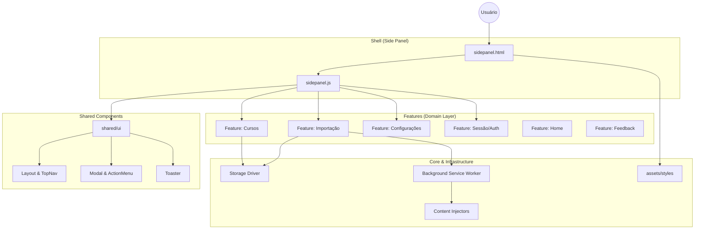

# 🏗️ Especificação de Arquitetura e Tecnologia

> **Status**: Produção (v2.6.3) - Atualizado: 2025-12-20
> **Arquitetura**: Screaming Architecture (Domain-Driven)
> **Plataforma**: Google Chrome Extensions (Manifest V3)

Este documento atua como a **Fonte da Verdade Arquitetural** do projeto. Ele define as restrições, padrões e fronteiras que garantem a longevidade e manutenibilidade do software.

---

## 1. Princípios Arquiteturais (The Axioms)

### 1.1 Screaming Architecture (A Arquitetura que Grita)
A estrutura de diretórios do projeto reflete **o que o sistema faz**, não de que o sistema é feito.
*   **Intenção > Ferramenta**: Ao abrir a raiz do projeto, um desenvolvedor deve ver *Casos de Uso* (Cursos, Importação), não *Frameworks* (Controllers, Views).
*   **Regra**: Se uma nova funcionalidade de negócio for adicionada, uma nova pasta em `features/` deve nascer.

### 1.2 Local-First & Zero-Backend
O sistema opera sob o princípio de soberania de dados do usuário.
*   **Persistência**: Todo dado reside estritamente no `chrome.storage` local.
*   **Sincronização**: Ocorre apenas através do mecanismo nativo do Chrome (Google Account), sem servidores intermediários proprietários.
*   **Offline-Capable**: A lógica de negócio independe de conectividade constante, salvo para operações de scraping (AVA/SEI).

### 1.3 Dependências Mínimas (Vanilla First)
A longevidade do projeto é priorizada sobre a conveniência imediata.
*   **Sem Frameworks de UI**: Uso de HTML/CSS/JS nativos e Custom Elements (se necessário) para evitar *framework fatigue* e obsolescência.
*   **Sem Transpilação em Runtime**: O código em produção é ES Modules nativo, suportado diretamente pela V8 engine moderna.

---

## 2. Entry Points da Extensão (Manifest V3)

A extensão possui **4 pontos de entrada** principais, cada um com responsabilidades distintas definidas no `manifest.json`:

### 2.1 Background Service Worker (`scripts/background.js`)
**Contexto de Execução**: Isolado, sem acesso direto ao DOM.
**Ciclo de Vida**: Event-driven (dorme quando não há eventos, acorda sob demanda).
**Responsabilidades**:
- Gerenciar evento de instalação/atualização da extensão
- Escutar cliques no ícone da extensão (action)
- Coordenar comunicação entre diferentes contexts (content scripts, sidepanel, popup)
- Persistir e sincronizar dados via `chrome.storage`

### 2.2 Side Panel (`sidepanel/sidepanel.html` + `sidepanel.js`)
**Contexto de Execução**: Frame próprio, DOM isolado.
**Ciclo de Vida**: Persiste enquanto está aberto; fechado = destruído.
**Responsabilidades**:
- **Entry point principal da UI** da extensão
- `sidepanel.js` atua como **Orchestrator**, instanciando todas as features:
  ```javascript
  const layout = new MainLayout({
    home: new HomeView(...),
    courses: new CoursesList(...),
    settings: new SettingsView(...)
  });
  ```
- Gerenciar navegação entre views (`home`, `courses`, `settings`, etc.)
- Carregar CSS global (`assets/styles/`)

### 2.3 Popup (`popup/popup.html` + `popup.js`)
**Contexto de Execução**: Frame efêmero, destruído ao fechar.
**Ciclo de Vida**: Abre ao clicar no ícone (se configurado), fechado = destruído.
**Responsabilidades**:
- Interface alternativa rápida (opcional, desativada por padrão)
- Links rápidos para portais (SEI, AVA, Provas)
- Configurável via `chrome.storage.sync.clickBehavior` (popup vs sidepanel)

### 2.4 Content Script (`scripts/content.js`)
**Contexto de Execução**: Injeta-se na página `https://sei.univesp.br/*`.
**Ciclo de Vida**: Carregado quando o usuário navega para o domínio permitido.
**Responsabilidades**:
- Autopreencher campo de email no formulário de login do SEI
- Lê configuração de `chrome.storage.sync.userEmail`
- Executa em **Isolated World** (acessa DOM da página, mas variáveis JS ficam isoladas)

### 2.5 Fluxo de Carregamento (Sidepanel)
```
[Chrome abre sidepanel]
  ↓
sidepanel.html (carrega)
  ↓ <link rel="stylesheet" href="../assets/styles/...">
  ↓ <script type="module" src="sidepanel.js">
  ↓
sidepanel.js (executa)
  ↓ import { MainLayout } from '../shared/ui/layout/MainLayout.js'
  ↓ import { HomeView } from '../features/home/ui/HomeView.js'
  ↓ ... (demais features)
  ↓
Instancia MainLayout(views) → Renderiza UI
```

---

## 3. Anatomia do Sistema (Manifest V3)

O sistema é dividido em três camadas concêntricas de responsabilidade.



### 2.1 Camada de Features (`/features`)
O coração do software. Cada pasta aqui é um *Bounded Context* autônomo.
*   **Estrutura Canônica de uma Feature**:
    *   `ui/`: Componentes visuais (burros). Renderizam dados e emitem eventos.
    *   `logic/`: Regras de negócio puras (testáveis unitariamente, agnósticas de DOM).
    *   `data/`: Repositórios e DTOs. Responsáveis pela persistência e hidratação de dados.
    *   `services/`: Integração com o mundo externo (Scrapers, Parsers).
    *   `tests/`: Testes unitários e de integração colocalizados.

### 2.2 Camada Shell (`/sidepanel`)
O container minimalista que hospeda as features.
*   **Responsabilidade**: Boot do sistema e orquestração de features.
*   **Conteúdo Atual**: Apenas `sidepanel.html` (entry point) e `sidepanel.js` (orchestrator).
*   **Restrição**: O Shell *não conhece* regras de negócio. Ele apenas instancia a Feature solicitada.
*   **Nota**: Após a refatoração Screaming Architecture (Fases 2-3), components, utils e styles foram migrados para `shared/` e `features/`.

### 2.3 Camada Shared & Infrastructure (`/shared`, `/scripts`, `/assets`)
Mecanismos reutilizáveis e infraestrutura.
*   **`shared/ui`**: Componentes de interface reutilizáveis (Modal, ActionMenu, Layout, Toaster).
*   **`shared/utils`**: Utilitários genéricos (Tabs [REF-10], BrowserUtils, Settings).
*   **`shared/logic`**: Lógica compartilhada entre features (AutoScroll).
*   **`assets/styles`**: CSS global e componentes visuais centralizados.
*   **Background Service Worker**: Gerencia ciclo de vida, eventos de sistema e comunicação cross-context.
*   **Content Scripts**: Atuam como sensores e atuadores na página do AVA/SEI. Executam em *Isolated World*.

### 2.4 Estrutura Física Atual

Após a conclusão das Fases 2 e 3 da refatoração Screaming Architecture (Dez/2025):

```
extensaoUNIVESP/
├── assets/
│   ├── styles/              # CSS centralizado (global, layout, components, views)
│   └── *.png                # Ícones da extensão
├── features/
│   ├── courses/             # Gestão de Cursos
│   │   ├── components/      # CourseItem, WeekItem, AddManualModal
│   │   ├── views/           # CoursesList, CourseDetails
│   │   ├── data/            # CourseRepository
│   │   ├── logic/           # CourseService, TermParser, CourseGrouper
│   │   ├── services/        # CourseDetector, CourseRefresher
│   │   ├── import/          # Submódulo: Importação em Lote
│   │   │   ├── components/  # BatchImportModal
│   │   │   ├── logic/       # BatchImportFlow
│   │   │   ├── services/    # BatchScraper
│   │   │   └── tests/
│   │   └── tests/
│   ├── session/             # Autenticação e Sessão (Nova - Phase 2)
│   │   ├── components/      # LoginWaitModal
│   │   └── logic/           # SessionManager (ex-RaManager)
│   ├── settings/            # Configurações do Usuário
│   │   ├── components/      # ConfigForm (Nova - Phase 3)
│   │   ├── logic/           # DomainManager
│   │   └── ui/              # SettingsView
│   ├── home/                # Tela Inicial
│   │   └── ui/              # HomeView
│   └── feedback/            # Feedback do Usuário
│       └── ui/              # FeedbackView
├── shared/
│   ├── ui/                  # Componentes reutilizáveis (Nova - Phase 2/3)
│   │   ├── layout/          # MainLayout, TopNav
│   │   ├── feedback/        # Toaster (ex-StatusManager)
│   │   ├── Modal.js
│   │   └── ActionMenu.js
│   ├── utils/               # Utilitários genéricos
│   │   ├── Tabs.js
│   │   ├── BrowserUtils.js
│   │   └── settings.js
│   └── logic/
│       └── AutoScroll.js
├── sidepanel/               # Shell minimalist (Phase 3 cleanup)
│   ├── sidepanel.html       # Entry point HTML
│   └── sidepanel.js         # Orchestrator
├── scripts/
│   ├── background.js        # Service Worker
│   └── content.js           # Content Script
├── popup/                   # Popup alternativo (opcional)
└── tests/                   # Testes globais e de integração
```

**Nota Histórica**: Antes da refatoração (pré-Dez/2025), todo o código vivia em `sidepanel/components`, `sidepanel/utils` e `sidepanel/styles`. A migração para a estrutura atual foi concluída em 3 fases, priorizando features de negócio primeiro, depois componentes compartilhados, e finalmente assets.

---

## 3. Regras de Fronteira (Boundaries)

### 3.1 A Regra de Dependência
O sentido das dependências deve apontar sempre em direção à estabilidade.
1.  **Features dependem de Core/Shared**: ✅ Permitido.
2.  **Core depende de Features**: ❌ PROIBIDO. O Background Worker não deve importar lógica de cálculo de média.
3.  **Feature depende de Feature**: ⚠️ EVITAR.
    *   `courses/import` faz parte do domínio `courses`, então pode usar `CourseRepository`.
    *   Mas `settings` não deve importar diretamente a View de Cursos (use eventos).

### 3.2 Isolamento de CSS
Para evitar colisão de estilos em um ambiente sem Shadow DOM obrigatório:
*   **Namespacing BEM**: `.feature-name__component--modifier` (ex: `.courses-list__item--active`).
*   **CSS Variables**: Definição global de tokens em `global.css`, consumo local nas features.

---

## 4. Stack Tecnológica Detalhada

| Contexto | Tecnologia | Decisão / Justificativa |
| :--- | :--- | :--- |
| **Language** | ES2022+ / Web Standards | Uso de recursos modernos (Classes, Async/Await, Modules) nativos. |
| **Module System** | ES Modules (ESM) | Padrão web. Permite imports estáticos e análise de árvore (Tree Shaking se necessário). |
| **Testing** | Jest + JSDOM | Standard da indústria. Alta performance e cobertura. |
| **Mocking** | jest-webextension-mock | Simulação fidedigna do ambiente hostil da Chrome API. |
| **Linting** | ESLint (Flat Config) | Controle de qualidade estático rigoroso (Zero Warnings Policy). |
| **Formatting** | Prettier | Consistência visual automatizada. |
| **Versioning** | SemVer | Controle semântico de mudanças (Major.Minor.Patch). |

---

## 5. Diretrizes de Desenvolvimento

### 5.1 Adicionando Nova Funcionalidade
Processo obrigatório para expansão do sistema:
1.  **Definir Domínio**: A nova funcionalidade pertence a um domínio existente?
    *   *Sim* -> Adicionar a `features/<dominio>`.
    *   *Não* -> Criar nova `features/<novo-dominio>`.
2.  **Criar Estrutura**: Replicar a anatomia canônica (`ui`, `logic`, `data`, `tests`).
3.  **Test-First**: Escrever o teste de integração da regra de negócio principal.
4.  **Implementar**: Codificar a lógica agnóstica de UI.
5.  **Conectar**: Criar a UI e conectar os eventos no `index.js` da feature.
6.  **Expor**: Exportar apenas o necessário (Facade) no `index.js` para o Shell consumir.

### 5.2 Gerenciamento de Estado
*   **Efêmero (UI State)**: Mantido em memória nas classes de Controller/View enquanto o Sidepanel está aberto.
*   **Persistente (User Data)**: Gravado imediatamente no `chrome.storage`.
*   **Reatividade**: Atualizações de UI ocorrem via re-renderização explícita ou observadores de eventos, evitando a complexidade de Virtual DOM para esta escala de aplicação.

---

> *Este documento deve ser revisado a cada Major Release para garantir que a implementação não divergiu da arquitetura.*
