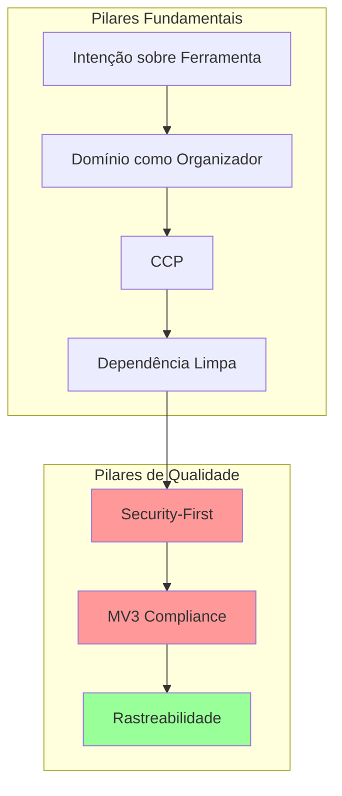

# VIS: Manifesto de Arquitetura
**Versão**: v2.10.0 | **Padrão**: Vertical Slices + Security-First  
**Atualizado**: 2026-01-06

> "Arquitetura que grita seu propósito de negócio, com segurança e qualidade como pilares fundamentais."

---

## 🎯 Pilares Fundamentais

### 1. Intenção sobre Ferramenta
**Negócio (UNIVESP) > UI**  
O código deve gritar o domínio do problema (gestão acadêmica) antes de revelar ferramentas técnicas (React, Chrome APIs).

📖 *Referência*: [ADR-000-A: Screaming Architecture](ADR_000_A_SCREAMING_ARCHITECTURE.md)

---

### 2. Domínio como Organizador
**features/ agrupa UI, Lógica e Dados**  
Organização por Vertical Slices (features de negócio) em vez de camadas técnicas (MVC).

```
features/
  courses/          # Tudo sobre cursos
  import/           # Tudo sobre importação
  session/          # Tudo sobre login
shared/             # Kernel compartilhado
```

📖 *Referência*: [ADR-000-A](ADR_000_A_SCREAMING_ARCHITECTURE.md)

---

### 3. Common Closure Principle (CCP)
**Coisas que mudam juntas ficam juntas**  
Features agrupam código que muda pela mesma razão de negócio.

📖 *Referência*: [ADR-000-A](ADR_000_A_SCREAMING_ARCHITECTURE.md)

---

### 4. Dependência Limpa
**Domínio agnóstico de I/O**  
Lógica de negócio não deve depender de chrome.storage, DOM ou APIs externas.

📖 *Referência*: [ADR-000-A](ADR_000_A_SCREAMING_ARCHITECTURE.md)

---

### 5. Security-First 🔒 **NOVO**
**Validação obrigatória de dados externos**  
- ✅ Zero `innerHTML` com dados dinâmicos não-sanitizados
- ✅ Tipos JSDoc explícitos em funções públicas  
- ✅ Validação de dados do AVA, usuário e chrome.storage
- ✅ SafeResult pattern em I/O boundaries

📖 *Referências*: [ADR-009: Security-First](ADR_009_SECURITY_FIRST.md), [ADR-002: SafeResult](ADR_002_SAFERESULT_PATTERN.md)

---

### 6. MV3 Compliance 🌐 **NOVO**
**Service Worker efêmero, permissões mínimas**  
- ✅ Event-driven architecture (zero keepalive hacks)
- ✅ Estado crítico em chrome.storage (não memória volátil)
- ✅ Permissões mínimas (`storage`, `sidePanel`, `scripting`)
- ✅ Single Purpose: "Produtividade Acadêmica UNIVESP"

📖 *Referência*: [ADR-010: Manifest V3 Strategy](ADR_010_MANIFEST_V3_STRATEGY.md)

---

### 7. Rastreabilidade Total 📝 **NOVO**
**ADR ↔ Issue ↔ PR ↔ Commit**  
- ✅ Conventional Commits obrigatório
- ✅ Issues linkadas em PRs
- ✅ ADRs atualizados quando decisões mudam
- ✅ Breaking changes documentadas

📖 *Referências*: [ADR-012: Definition of Done](ADR_012_DEFINITION_OF_DONE.md), [ADR-011: Git Flow](ADR_011_PROTECTED_BRANCHES.md)

---

## ⚖️ Regras de Ouro

### Código
- ✅ **Relativo é Lei**: Imports locais sempre relativos
- ✅ **Type-Safety**: Zero `@type {*}` ou `@type {Object}` em produção
- ✅ **Zero Console Log**: Usar `Logger.js` com namespaces

📖 *Referência*: [ADR-000-B: JSDoc Typing](ADR_000_B_JSDOC_TYPING.md), [ADR-004: Logger](ADR_004_OBSERVABILITY_LOGGER.md)

---

### Qualidade
- ✅ **Zero Broken Windows**: Branch sempre verde (`npm run verify`)
- ✅ **AAA Testing**: Arrange-Act-Assert obrigatório
- ✅ **Refatoração exige teste**: Unitário ou integração

📖 *Referências*: [ADR-000-C: AAA Testing](ADR_000_C_AAA_TESTING_PATTERN.md), [ADR-006: Integration Tests](ADR_006_TEST_STRATEGY_REFRESHER.md)

---

### Processo
- ✅ **Git Flow**: PR-only em `main` e `dev`
- ✅ **DoD Obrigatório**: Quality Gates + Test Coverage + Documentation
- ✅ **Code Review**: 1+ aprovação para merge

📖 *Referências*: [ADR-011: Protected Branches](ADR_011_PROTECTED_BRANCHES.md), [ADR-012: DoD](ADR_012_DEFINITION_OF_DONE.md)

---

## 🎨 Consequências Aceitas

### Trade-offs Positivos
- ✅ Onboarding rápido (features gritam propósito)
- ✅ Baixo acoplamento entre features
- ✅ Type-safety sem build step
- ✅ Segurança por padrão (reduz XSS)
- ✅ Compliance com Chrome Web Store

### Trade-offs Negativos (Mitigados)
- ⚠️ Verbosidade em JSDoc → Templates de VSCode
- ⚠️ Risco de poluição em `shared/` → Code review rigoroso
- ⚠️ Testes híbridos mais lentos → Apenas em fluxos críticos
- ⚠️ Service Worker efêmero dificulta debug → Logging estruturado

---

## 📚 Documentação Relacionada

- [ADR Index](README.md): Lista completa de decisões arquiteturais
- [OBSERVABILITY_PLAN.md](OBSERVABILITY_PLAN.md): Estratégia de logging
- [Conventional Commits](../../PADROES.md): Padrão de commits

---

## 📐 Arquitetura Visual



---

## 🚀 Histórico de Versões

| Versão | Data | Mudanças |
|--------|------|----------|
| v2.9.7 | 2025-12 | Versão inicial minimalista |
| **v2.10.0** | 2026-01 | + Security-First, MV3 Compliance, Rastreabilidade |

---

**Mantido por**: Equipe de Arquitetura  
**Revisão**: Trimestral ou quando ADR crítico é adicionado
