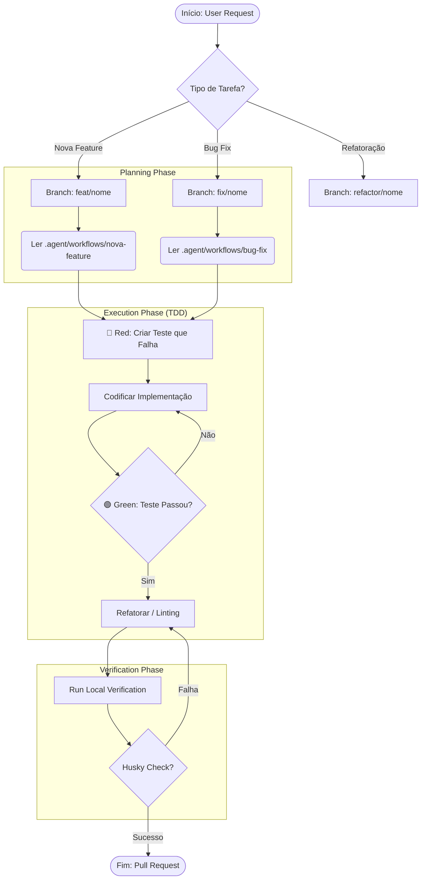

# Resumo de Workflow & Engenharia de Processos

> **Síntese Executiva:** Este documento consolida o estudo sobre a engenharia de processos do projeto, unificando a teoria (Worktree/Workflow) e a prática (BPMN).

---

## 🗺️ 1. Mapa de Leitura (Onboarding)

Para entender este sistema complexo, siga esta ordem de leitura.

### 🟢 Nível 1: Fundamentos (Obrigatório)
1.  **[README.md](../../README.md)**: A visão geral do produto.
2.  **[FLUXOS_DE_TRABALHO.md](../FLUXOS_DE_TRABALHO.md)**: "Como nós trabalhamos". As regras humanas.
3.  **[.cursorrules](../../.cursorrules)**: As leis técnicas "imutáveis".

### 🟡 Nível 2: Arquitetura e Padrões
4.  **[TECNOLOGIAS_E_ARQUITETURA.md](../TECNOLOGIAS_E_ARQUITETURA.md)**: O mapa do território.
5.  **[PADROES_DO_PROJETO.md](../PADROES_DO_PROJETO.md)**: O guia de estilo.
6.  **[manual-engenharia.md](../manual-engenharia.md)**: A análise teórica da nossa prática.
7.  **[REGRAS_DE_NEGOCIO.md](../REGRAS_DE_NEGOCIO.md)**: O manual do comportamento do sistema.

### 🔴 Nível 3: Operação Avançada
8.  **Este Documento**: O BPMN operacional e Teoria Unificada.

---

## 🔄 2. BPMN do Desenvolvedor

Este é o algoritmo que seguimos para transformar um pedido em código.

---

## 🏗️ 3. Teoria Unificada: Workflow + Worktree

### 1️⃣ O Documento é a Lei (Workflow)
O arquivo `FLUXOS_DE_TRABALHO.md` define as regras ("O que fazer").
*   **Quality Gates:** Husky impede entropia.
*   **Grafo Direcionado:** `dev` é a origem e destino.

### 2️⃣ O Worktree é o Mecanismo (Ferramenta)
O `git worktree` facilita a vida ("Como fazer rápido").
*   **Paralelismo:** Múltiplas branches em pastas isoladas.
*   **Contexto:** Sem *Context Switching* custoso.

### 3️⃣ Regra de Ouro
> **Workflow** é a Lei. **Worktree** é a Ferramenta.
Use Worktree para multitasking. Use Workflow para qualidade.
