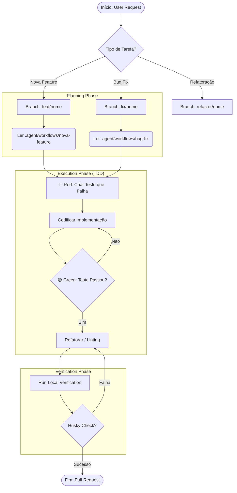

# Mapa de Processos e Engenharia de Software

## 🗺️ 1. Mapa de Leitura (Onboarding)

Para entender este sistema complexo, siga esta ordem de leitura. Cada documento constrói a base para o próximo.

### 🟢 Nível 1: Fundamentos (Obrigatório)
1.  **[README.md](../../README.md)**: A visão geral do produto.
2.  **[FLUXOS_DE_TRABALHO.md](../../docs/FLUXOS_DE_TRABALHO.md)**: "Como nós trabalhamos". As regras humanas.
3.  **[.cursorrules](../../.cursorrules)**: As leis técnicas "imutáveis" (Mentalidade Zero Warnings, TDD).

### 🟡 Nível 2: Arquitetura e Padrões
4.  **[TECNOLOGIAS_E_ARQUITETURA.md](../../docs/TECNOLOGIAS_E_ARQUITETURA.md)**: O mapa do território (MVC, Pastas).
5.  **[PADROES_DO_PROJETO.md](../../docs/PADROES_DO_PROJETO.md)**: O guia de estilo (Linting, Commits).
6.  **[manual-engenharia.md](../engenharia/manual-engenharia.md)**: A análise teórica da nossa prática.
7.  **[REGRAS_DE_NEGOCIO.md](../../docs/REGRAS_DE_NEGOCIO.md)**: O manual do comportamento do sistema (`Tabs.js`, `Scraper`).

### 🔴 Nível 3: Operação Avançada (SCM)
8.  **Este Documento**: O BPMN operacional.
9.  **[analise-workflow-atual.md](analise-workflow-atual.md)**: A auditoria do estado atual.

---

## 🔄 2. BPMN do Desenvolvedor (Business Process Model)

Este é o algoritmo que seguimos para transformar um pedido em código.

---

## 🏗️ 3. Teoria Unificada: Workflow + Worktree

Respondendo formalmente como estruturamos o caos usando Ciência da Computação.

### 1️⃣ O Documento é a Lei (Workflow)
O arquivo `FLUXOS_DE_TRABALHO.md` não é sugestão, é definição de processo.
*   **Define Regras:** "Não existe código sem teste".
*   **Organiza o Grafo (DAG):** Define onde nasce (`dev`) e onde morre uma branch.
*   **Quality Gates:** Husky é o guarda que impede a entrada de entropia no sistema.
👉 **Isso é Git Workflow na prática.**

### 2️⃣ O Worktree é o Mecanismo (Ferramenta)
O `git worktree` não altera a "Constituição" (regras), apenas facilita a vida do cidadão.
*   **Não muda branches:** A estrutura lógica do grafo de commits permanece idêntica.
*   **Não muda governança:** As regras de aprovação continuam as mesmas.
👉 **Ele apenas materializa branches paralelas em pastas físicas diferentes.**

### 3️⃣ Por que usamos Worktree? (Eficiência de Contexto)
Em sistemas complexos, o custo de troca de contexto (*Context Switching*) é alto.
*   **Uma pasta = Uma branch:** `../feat-login` e `../fix-header` coexistem.
*   **Sem `git stash`:** Não precisamos "esconder" trabalho para atender urgências.
*   **Isolamento Físico:** `node_modules` e arquivos temporários não vazam entre tarefas.
👉 **Resultado: Menor carga cognitiva e zero risco de "commitar o arquivo errado".**

### 4️⃣ A Conexão (Workflow 🤝 Worktree)
*   **Workflow** define **O QUE** deve ser feito (O Processo Lógico).
*   **Worktree** define **COMO** trabalhar sem atrito (O Processo Físico).
👉 **Um é o software (regras), o outro é o hardware (file system) do seu processo de trabalho.**

### 5️⃣ Regra Prática (Heurística de Decisão)
Quando adotar essa complexidade?
*   Você trabalha em múltiplas tasks (multithreading humano)? **SIM.**
*   Precisa manter `main` (prod) e `dev` (homolog) acessíveis simultaneamente? **SIM.**
*   O projeto exige revisão rigorosa e pausas frequentes? **SIM.**

👉 **Use Workflow (Regras) + Worktree (Pastas) para escalar sua produtividade.**
