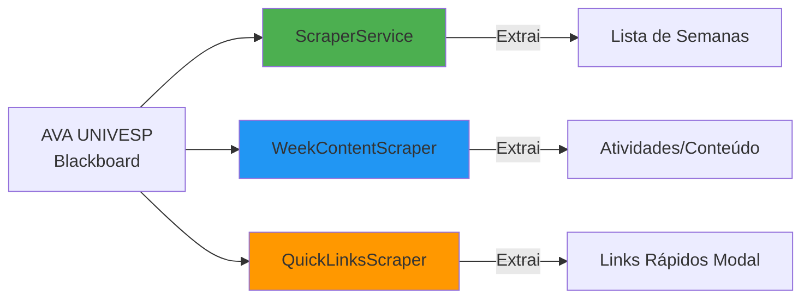
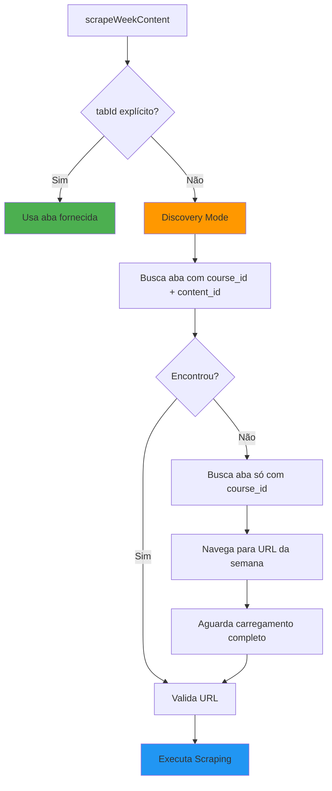
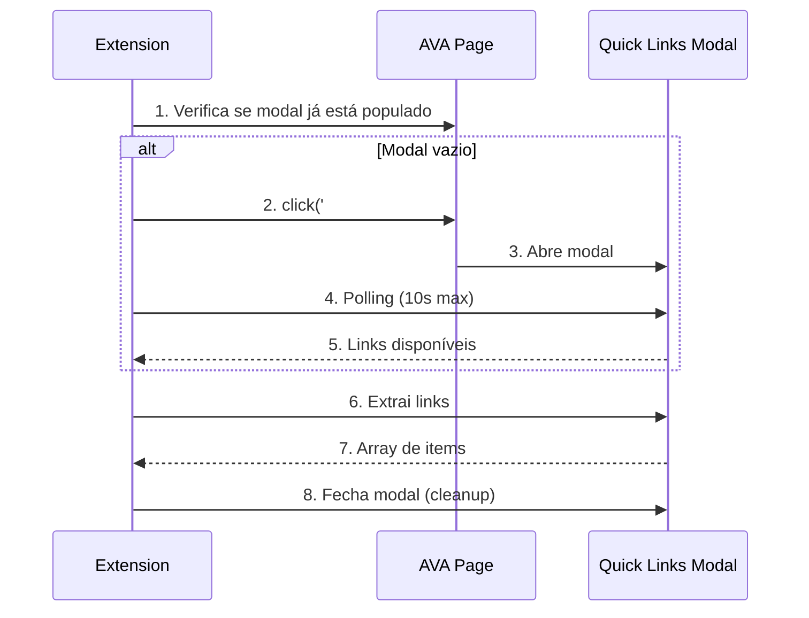

# 📊 O Que o Código Já Faz: Sistema de Scraping do AVA

> **Objetivo**: Mapear a funcionalidade atual de scraping do AVA UNIVESP (Blackboard Learn) para entender o que já funciona antes de calibrar/corrigir.

---

## 🎯 Visão Geral

O sistema possui **3 Scrapers especializados**, cada um com responsabilidades específicas:



---

## 1️⃣ ScraperService - Extrator de Semanas

**Arquivo**: [`ScraperService.js`](file:///home/sant/extensaoUNIVESP/features/courses/services/ScraperService.js)

### ✅ O Que Faz

Extrai a **lista de semanas** (Semana 1, Semana 2, etc.) de um curso do AVA.

### 🔍 Seletores CSS Utilizados

```javascript
// Busca TODOS os links <a> da página
document.querySelectorAll('a')
```

### 📝 Regex de Identificação

```javascript
/^Semana\s+(\d{1,2})$/i
```

**Detecta**: `"Semana 1"`, `"Semana 10"`, `"semana 15"` (case-insensitive)

> ⚠️ **PROBLEMA ATUAL**: Esta regex **NÃO captura "Revisão"** ou variações de menu!

### 🎯 Estratégia de Extração

1. **Busca em 2 locais**:
   - `<a>` → `innerText` (texto visível)
   - `<a>` → `title` (atributo title)

2. **Filtragem**:
   - Apenas semanas **1 a 15**
   - Ignora links `javascript:` sem `onclick` handler

3. **Extração de Título do Curso**:
   ```javascript
   // Prioridade 1
   document.querySelector('p.discipline-title')
   
   // Fallback
   document.querySelector('h1.panel-title')
   ```

### 🚀 Execução

```javascript
// Injeta em TODOS os frames da aba
chrome.scripting.executeScript({
  target: { tabId: tabId, allFrames: true },
  func: DOM_extractWeeks_Injected
});
```

### 📤 Output

```javascript
{
  weeks: [
    { name: "Semana 1", url: "https://ava.univesp.br/..." },
    { name: "Semana 2", url: "https://ava.univesp.br/..." }
  ],
  title: "Extensão Universitária"
}
```

---

## 2️⃣ WeekContentScraper - Extrator de Atividades

**Arquivo**: [`WeekContentScraper.js`](file:///home/sant/extensaoUNIVESP/features/courses/services/WeekContentScraper.js)

### ✅ O Que Faz

Extrai **atividades/conteúdos** de uma semana específica usando **Strategy Pattern**.

### 🔍 Seletores CSS Utilizados

```javascript
// Busca containers de atividades (3 estratégias de fallback)
1. li[id^="contentListItem:"]  // Blackboard padrão
2. li.liItem                     // Alternativa 1
3. #contentList li, .contentList li, ul.contentList li  // Alternativa 2
```

### 🎯 Navegação Inteligente

O scraper possui um **sistema sofisticado de descoberta de abas**:



### 📋 Extração com Retry

```javascript
// Tenta 3 vezes com delay de 1.5s entre tentativas
let retries = 3;
while (retries > 0) {
  await new Promise(resolve => setTimeout(resolve, 1500));
  // Extrai HTML relevante
  // Se items.length > 0: SUCESSO!
  retries--;
}
```

### 🏗️ Strategy Pattern

Usa **`StrategyRegistry`** para delegar extração conforme tipo de item:

```javascript
const strategy = registry.getStrategy(li);
const item = strategy.extract(li);
```

### 📤 Output

```javascript
[
  {
    name: "Videoaula 1",
    id: "anonymous_element_1",
    type: "video"
  },
  {
    name: "Fórum de Discussão",
    id: "anonymous_element_2",
    type: "forum"
  }
]
```

---

## 3️⃣ QuickLinksScraper - Extrator de Modal

**Arquivo**: [`QuickLinksScraper.js`](file:///home/sant/extensaoUNIVESP/features/courses/services/QuickLinksScraper.js)

### ✅ O Que Faz

Extrai atividades do **modal "Links Rápidos"** do Blackboard (método alternativo).

### 🔍 Seletores CSS Utilizados

```javascript
// Links dentro do modal Links Rápidos
li.quick_links_header_h3 a
```

### 🎯 Fluxo de Execução



### 🔧 Extração de ID

O ID é extraído do atributo `onclick`:

```javascript
// onclick format:
// quickLinks.messageHelper.activateElement("2641727", "anonymous_element_9", ...)

// Regex extrai o SEGUNDO parâmetro (elementId)
/activateElement\s*\(\s*["'][^"']+["']\s*,\s*["']([^"']+)["']/
```

### 📤 Output

```javascript
[
  {
    name: "Atividade 1",
    id: "anonymous_element_9",
    type: "document"
  }
]
```

---

## 🎨 Marcadores de Código (Issues)

O código possui **marcadores `//ISSUE-missing-revision-week`** indicando pontos que precisam ser ajustados:

### 📍 Locais com #STEP

| Arquivo | Linha | Marcador | Descrição |
|---------|-------|----------|-----------|
| [`ScraperService.js`](file:///home/sant/extensaoUNIVESP/features/courses/services/ScraperService.js#L30) | 30 | `#STEP-3` | Usar `WEEK_IDENTIFIER_REGEX` centralizada |
| [`ScraperService.js`](file:///home/sant/extensaoUNIVESP/features/courses/services/ScraperService.js#L131) | 131 | `#STEP-3` | Usar `CourseStructure.sortWeeks()` |
| [`ScraperService.js`](file:///home/sant/extensaoUNIVESP/features/courses/services/ScraperService.js#L174) | 174 | `#STEP-4` | Passar regex como argumento na injeção |

---

## 📊 DADOS REAIS: Audit AVA Executado

> **Data da Coleta:** 2025-12-30  
> **Disciplina:** LET100 (Extensão Universitária)  
> **Arquivo:** [`listaSemanaRevisa.txt`](file:///home/sant/extensaoUNIVESP/docs/review_notes/listaSemanaRevisa.txt)

### ✅ Confirmações Importantes

#### 1. **"Revisão" EXISTE e É Válida!**

```
paletteItem:_304012_1
├─ title: "Revisão"
├─ contentId: "_1763497_1"  ✅ VÁLIDO!
└─ href: "/webapps/blackboard/content/listContent.jsp?course_id=_15307_1&content_id=_1763497_1"
```

🎯 **Impacto:** O bug está CONFIRMADO! A extensão ignora este item por causa da regex `/^Semana\s+(\d{1,2})$/i`.

#### 2. **"Menu das Semanas" É Separador Visual**

```
paletteItem:_304023_1
├─ title: "Menu das Semanas"
├─ contentId: "" ❌ SEM CONTENT
└─ href: ""
```

🎯 **Impacto:** É apenas um divisor visual no menu. Não precisa ser capturado para scraping de conteúdo.

#### 3. **Estrutura Completa do Curso**

**26 itens de paleta encontrados:**

| Tipo | Quantidade | Exemplos |
|------|------------|----------|
| **Semanas Numeradas** | 7 | Semana 1, 2, 3, 4, 5, 6, 7 |
| **Semana Especial** | 1 | Revisão ⭐ |
| **Menu/Separador** | 1 | Menu das Semanas |
| **Ferramentas** | 8 | Avisos, Fóruns, Atividades, etc. |
| **Documentos** | 4 | Gabaritos, Referências, etc. |
| **Separadores Vazios** | 5 | Elementos `<li>` sem conteúdo |

### 🎯 Padrões Detectados pelo Audit

```javascript
{
  semana: [
    'Menu das Semanas',  // Separador
    'Semana 1',
    'Semana 2',
    'Semana 3',
    'Semana 4',
    'Semana 5',
    'Semana 6',
    'Semana 7'
  ],
  revisao: [
    'Revisão'  // ⭐ ESTE É O BUG!
  ],
  menu: [
    'Menu das Semanas'
  ],
  numbered: [
    'Semana 1', 'Semana 2', 'Semana 3',
    'Semana 4', 'Semana 5', 'Semana 6', 'Semana 7'
  ]
}
```

### ✅ Validação da Solução Proposta

A **regex robusta** resolve TODOS os casos:

```javascript
// ✅ Nova regex que captura tudo
/^(Semana\s+(\d{1,2})|Semana\s+de\s+Revisão|Revisão)$/i
```

**Teste com dados reais:**

| Item do AVA | Regex Antiga | Regex Nova | Status |
|-------------|--------------|------------|--------|
| `"Semana 1"` | ✅ Captura | ✅ Captura | OK |
| `"Semana 7"` | ✅ Captura | ✅ Captura | OK |
| `"Revisão"` | ❌ **IGNORA** | ✅ **Captura** | 🎉 **FIXADO!** |
| `"Menu das Semanas"` | ❌ Ignora | ❌ Ignora | OK (separador) |

### 🔍 Insights Adicionais

1. **Cursos têm duração variável:**
   - Este curso: 7 semanas
   - Padrão UNIVESP: até 15 semanas
   - A regex `(\d{1,2})` suporta ambos ✅

2. **"Semana de Revisão" vs "Revisão":**
   - Este curso usa apenas `"Revisão"`
   - Outros cursos podem usar `"Semana de Revisão"`
   - Nossa regex suporta ambas ✅

3. **Ordem no menu:**
   ```
   Semana 1 → Semana 2 → ... → Semana 7 → Revisão
   ```
   - Revisão aparece **DEPOIS** das semanas numeradas
   - Ordenação atual já está correta ✅

---

## 🔑 Conclusões

### ✅ O Que Já Funciona

1. ✅ **Scraping de semanas numeradas** (1-15)
2. ✅ **Extração de atividades** de uma semana
3. ✅ **Navegação automática** entre abas do AVA
4. ✅ **Retry com timeout** para garantir carregamento
5. ✅ **Estratégia de fallback** (múltiplos seletores)
6. ✅ **Extração de IDs** para navegação

### ❌ O Que NÃO Funciona (Bug Atual)

1. ❌ **"Revisão" não é detectada** pela regex `/^Semana\s+(\d{1,2})$/i`
2. ❌ **"Menu das Semanas" não é detectado**
3. ❌ **Itens sem número** são ignorados

### 🎯 Próximos Passos

1. **Executar `audit-ava-dom.js`** no console do AVA
2. **Coletar dados reais** de nomenclatura
3. **Calibrar regex** para incluir "Revisão" e outros padrões
4. **Implementar WEEK_IDENTIFIER_REGEX centralizada**

---

## 🧪 Como Testar

### 1. Testar ScraperService

```javascript
// No console da extensão (background script)
import { ScraperService } from './features/courses/services/ScraperService.js';

const result = await ScraperService.scrapeWeeksFromTab(CURRENT_TAB_ID);
console.table(result.weeks);
```

### 2. Executar Audit Script

1. Abra: `https://ava.univesp.br/webapps/blackboard/content/listContent.jsp?course_id=...`
2. Console (F12)
3. Cole o conteúdo de [`audit-ava-dom.js`](file:///home/sant/extensaoUNIVESP/scripts/audit-ava-dom.js)
4. Analise o output

---

**Última Atualização**: 2025-12-30
