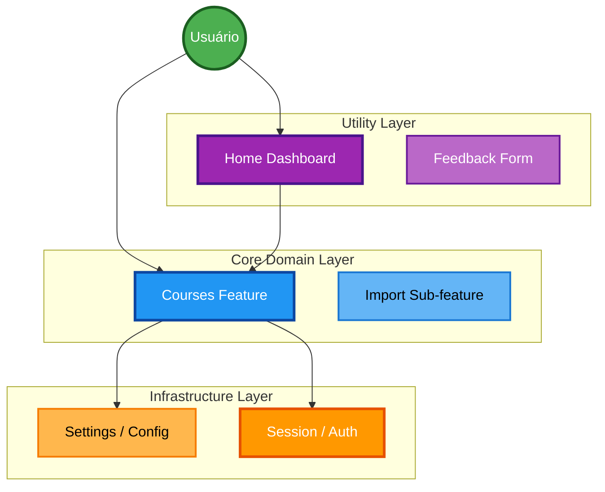

# Especificação de Features (Domain Layout)

Este diretório implementa uma arquitetura híbrida de **Screaming Architecture** com **Vertical Slices**.
A estrutura de pastas evidencia os domínios de negócio, onde cada pasta em `features/` contem uma fatia vertical completa da aplicação (View, Logic, Data).

---

## 1. Categorização de Domínio

As features são classificadas em três camadas arquiteturais para orientar o acoplamento.

### 1.1 Mapa de Relacionamento (`features/`)



### 1.2 Definições de Categoria

#### 🏆 Core Domain
**Definição**: Funcionalidades centrais que justificam a existêcia do produto.
- **Features**: `courses` (inclui `import`).
- **Característica**: Alta complexidade lógica, regras de negócio críticas.

#### 🔧 Infrastructure
**Definição**: Serviços transversais necessários para o funcionamento do Core.
- **Features**: `session`, `settings`.
- **Característica**: Estado global, Singleton, persistência de credenciais.

#### 📦 Utility
**Definição**: Interfaces de suporte e melhoria de UX.
- **Features**: `home`, `feedback`.
- **Característica**: Foco em UI, lógica rasa.

---

## 2. Anatomia Canônica de Feature

Cada feature constitui um *Bounded Context* autônomo. A camada de apresentação pode variar conforme a complexidade.

```text
features/<nome-da-feature>/
├── views/           # [Opção A] Telas Complexas (com sub-rotas ou lógica local)
├── ui/              # [Opção B] Telas Simples (Arquivo Único)
├── components/      # Widgets Locais (Reutilizáveis apenas nesta feature)
├── logic/           # Domain Services (Lógica Pura - Framework Agnostic)
├── data/            # Repositories (Persistência)
├── models/          # Type Definitions (JSDoc)
├── services/        # Integration Services (Scrapers, HTTP)
└── tests/           # Unit & Integration Tests
```

### 2.1 Matriz de Responsabilidade

| Diretório | Responsabilidade | Exemplo Real |
| :--- | :--- | :--- |
| **`logic/`** | Regras de negócio puras (Vanilla JS). | `CourseGrouper.js` |
| **`services/`** | Interação com APIs ou DOM externo. | `ScraperService.js` |
| **`data/`** | Abstração de persistência. | `CourseRepository.js` |
| **`views/`** | Telas complexas (Page Controller). | `CoursesView/` |
| **`ui/`** | Telas simples ou componentes de entrada. | `HomeView.js` |


---

## 3. Diretrizes de Implementação

### 3.1 Unidirectional Data Flow
Para garantir previsibilidade, o fluxo de dados deve respeitar a direção:
`UI (Event) -> Logic -> Repository -> Storage -> Repository -> UI (Render)`

### 3.2 Tipagem Estática (JSDoc)
O uso de validação de tipos é mandatório.
- **Models**: Devem estar definidos em `models/*.js` com `@typedef`.
- **Verificação**: `npm run type-check` garantirá a integridade das referências.

---

## 4. Features Implementadas (v2.9.2)

### `courses` (Core) 🏆
Gestão completa do ciclo de vida acadêmico com 56 diretórios e 105 arquivos.

**Estrutura Completa:**
```
courses/
├── components/          # UI Components
│   ├── AddManualModal/
│   ├── CourseItem.js
│   └── WeekItem.js
├── data/               # Persistência (Repository Pattern)
│   ├── CourseRepository.js
│   ├── CourseStorage.js
│   └── DATA_ACCESS.md
├── import/             # Sub-feature: Importação em Lote
│   ├── components/
│   ├── logic/
│   ├── services/       # BatchScraper
│   └── tests/
├── logic/              # Domain Services (Regras de Negócio)
│   ├── AutoScrollService.js
│   ├── CourseGrouper.js
│   ├── CourseService.js
│   ├── TaskCategorizer.js
│   └── TermParser.js
├── models/             # Type Definitions (JSDoc)
│   ├── ActivityProgress.js
│   ├── Course.js
│   └── Week.js
├── repositories/       # Persistência de Atividades
│   └── ActivityRepository.js (localStorage, 5MB quota)
├── repository/         # Persistência de Progresso
│   └── ActivityProgressRepository.js
├── services/           # Integration Services
│   ├── CourseRefresher.js
│   ├── QuickLinksScraper.js
│   ├── ScraperService.js
│   ├── TaskProgressService.js
│   ├── WeekActivitiesService.js (SafeResult pattern)
│   ├── WeekContentScraper/ (Strategy Pattern)
│   │   ├── strategies/ (7 strategies)
│   │   └── StrategyRegistry.js
│   └── WeekContentScraper.js
├── tests/              # Unit & Integration Tests (455 testes)
│   ├── components/
│   ├── CourseRepository/ (4 suites)
│   ├── integration/
│   ├── logic/ (5 suites)
│   ├── models/
│   ├── repositories/
│   ├── services/ (9 suites)
│   └── views/ (8 suites включая regression)
└── views/              # Page Controllers
    ├── CoursesView/
    ├── CourseWeeksView/ (modular com Managers)
    ├── CourseWeekTasksView/
    └── DetailsActivitiesWeekView/ (modular: 9 arquivos)
        ├── ActivityItemFactory.js
        ├── ActivityRenderer.js
        ├── ChipsManager.js
        ├── handlers/ (Clear, Refresh)
        ├── HeaderManager.js
        ├── SkeletonManager.js
        └── ViewTemplate.js
```

**Destaques v2.9.2:**
- **Logging Estruturado**: Centralização com `Logger.js` e tags semânticas (#LOG_UI, #LOG_SYSTEM).
- **Navegação Robusta (Scroll)**: Nova lógica Resilience-First no `NavigationService` (ADR-007).
- **Zero Warnings**: Linting estrito (`max-warnings=0`) e remoção de débitos técnicos de console.
- **Segurança de Regex**: Proteção contra ReDoS no `TaskCategorizer`.

### `home` (Utility) 📦
Dashboard central de acesso rápido.
- **UI**: `HomeView.js`
- **Testes**: `HomeView.test.js`

### `settings` (Infra) 🔧
Gerenciamento de configurações e preferências do usuário.
- **ui**: `SettingsView.js`, `components/ConfigForm.js`
- **logic**:
    - `SettingsController.js` (Orquestrador)
    - `EmailDomainValidator.js` (Validação)
    - `*Manager.js` (State Management: Chips, UI, UserPrefs)
- **services**: `BackupService.js` (com Schema Validation Segura)
- **Testes**: 3 suites unitárias + 3 integração

### `session` (Infra) 🔧
Gerenciamento de estado de autenticação (Blackboard/SEI).
- **Components**: `LoginWaitModal.js`
- **Logic**: `SessionManager.js` (Singleton)
- **Models**: `Session.js`
- **Testes**: `SessionManager.test.js`

### `feedback` (Utility) 📦
Interface de reporte de erros e sugestões.
- **UI**: `FeedbackView.js`
- **Testes**: `FeedbackView.test.js`

---

## 5. Métricas (v2.9.2)

| **Métrica | Valor |
| :--- | :--- |
| **Total de Diretórios** | 56 |
| **Total de Arquivos** | 108 |
| **Testes** | 455 passando (60 suites) |
| **Cobertura** | 78.5% (estimado) |
| **Linhas de Código** | ~15.100 (apenas .js) |

---

## 6. Referências

- **Arquitetura**: [`docs/TECNOLOGIAS_E_ARQUITETURA.md`](../docs/TECNOLOGIAS_E_ARQUITETURA.md)
- **Padrões de Código**: [`docs/PADROES.md`](../docs/PADROES.md)
- **Engineering Guide**: [`docs/ENGINEERING_GUIDE.md`](../docs/ENGINEERING_GUIDE.md)

