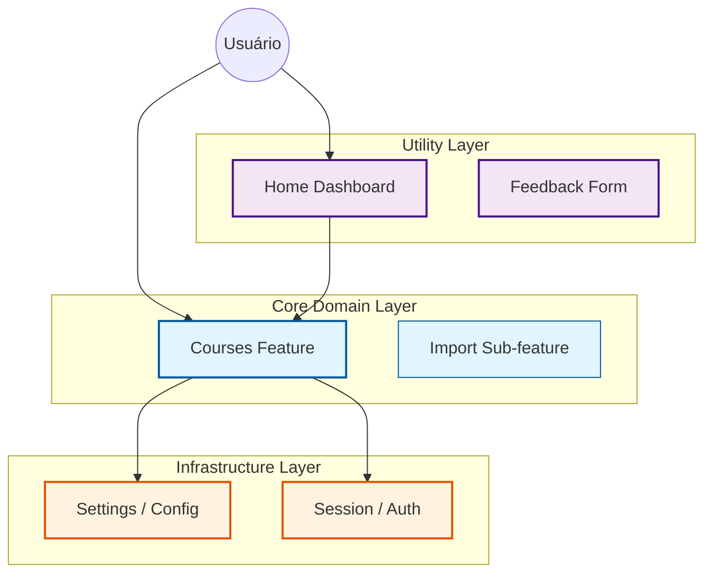

# Especificação de Features (Domain Layout)

Este diretório implementa o padrão **Screaming Architecture**, onde a estrutura de pastas evidencia os domínios de negócio do software.

---

## 1. Categorização de Domínio

As features são classificadas em três camadas arquiteturais para orientar o acoplamento.

### 1.1 Mapa de Relacionamento (`features/`)



### 1.2 Definições de Categoria

#### 🏆 Core Domain
**Definição**: Funcionalidades centrais que justificam a existêcia do produto.
- **Features**: `courses` (inclui `import`).
- **Característica**: Alta complexidade lógica, regras de negócio críticas.

#### 🔧 Infrastructure
**Definição**: Serviços transversais necessários para o funcionamento do Core.
- **Features**: `session`, `settings`.
- **Característica**: Estado global, Singleton, persistência de credenciais.

#### 📦 Utility
**Definição**: Interfaces de suporte e melhoria de UX.
- **Features**: `home`, `feedback`.
- **Característica**: Foco em UI, lógica rasa.

---

## 2. Anatomia Canônica de Feature

Cada feature constitui um *Bounded Context* autônomo. A camada de apresentação pode variar conforme a complexidade.

```text
features/<nome-da-feature>/
├── views/           # [Opção A] Telas Complexas (com sub-rotas ou lógica local)
├── ui/              # [Opção B] Telas Simples (Arquivo Único)
├── components/      # Widgets Locais (Reutilizáveis apenas nesta feature)
├── logic/           # Domain Services (Lógica Pura - Framework Agnostic)
├── data/            # Repositories (Persistência)
├── models/          # Type Definitions (JSDoc)
├── services/        # Integration Services (Scrapers, HTTP)
└── tests/           # Unit & Integration Tests
```

### 2.1 Matriz de Responsabilidade

| Diretório | Responsabilidade | Exemplo Real |
| :--- | :--- | :--- |
| **`logic/`** | Regras de negócio puras (Vanilla JS). | `CourseGrouper.js` |
| **`services/`** | Interação com APIs ou DOM externo. | `ScraperService.js` |
| **`data/`** | Abstração de persistência. | `CourseRepository.js` |
| **`views/`** | Telas complexas (Page Controller). | `CoursesView/` |
| **`ui/`** | Telas simples ou componentes de entrada. | `HomeView.js` |


---

## 3. Diretrizes de Implementação

### 3.1 Unidirectional Data Flow
Para garantir previsibilidade, o fluxo de dados deve respeitar a direção:
`UI (Event) -> Logic -> Repository -> Storage -> Repository -> UI (Render)`

### 3.2 Tipagem Estática (JSDoc)
O uso de validação de tipos é mandatório.
- **Models**: Devem estar definidos em `models/*.js` com `@typedef`.
- **Verificação**: `npm run type-check` garantirá a integridade das referências.

---

## 4. Features Implementadas (v2.8.0)

### `courses` (Core)
Gestão completa do ciclo de vida acadêmico.
- **Sub-módulos**: `import` (Importação em Lote).
- **Views**:
  - `CoursesView/`: Lista principal de cursos.
  - `CourseWeeksView/`: Detalhes de um curso (Lista de Semanas).
  - `CourseWeekTasksView/`: Detalhes de uma semana (Lista de Tarefas).

### `home` (Utility)
Dashboard central de acesso rápido.

### `settings` (Infra)
Gerenciamento de configurações e preferências do usuário.

### `session` (Infra)
Gerenciamento de estado de autenticação (Blackboard/SEI).

### `feedback` (Utility)
Interface de reporte de erros e sugestões.
