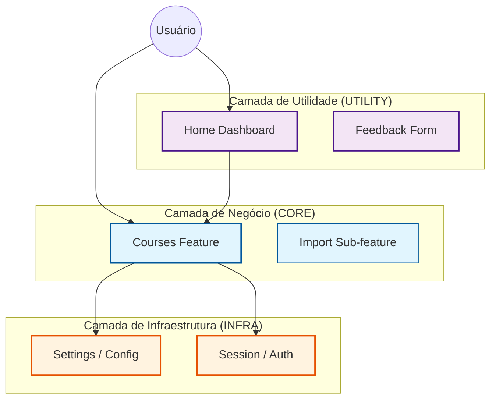
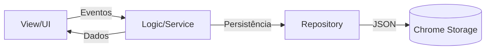

> Status: Active
> Last Update: 2025-12-20

# 🎯 Features (Screaming Architecture)

Esta pasta contém as **funcionalidades de negócio** do projeto, organizadas por domínio. Cada pasta aqui representa um caso de uso independente.

---

## 🧠 Por Que 6 Features (não 3)?

**Você pode estar pensando**: "TopNav tem 3 tabs (Home, Cursos, Configurações). Por que 6 pastas?"

**Resposta**: Screaming Architecture organiza por **domínio de negócio**, não por hierarquia de UI.

### 📊 Categorias e Mapa Mental

Entenda como as categorias se relacionam:



#### 1. 🏆 CORE (O Coração)
**"A razão de ser do software."**
- **Definição**: Domínio central (Gestão Acadêmica).
- **Recursos**: `courses`, `import`.
- **Características**: Lógica complexa, Persistência crítica.

#### 2. 🔧 INFRA (O Alicerce)
**"Serviços que ninguém vê, mas todos usam."**
- **Definição**: Serviços transversais (Auth, Config, Storage).
- **Recursos**: `session`, `settings`.
- **Características**: Singleton, Estado Global.

#### 3. 📦 UTILITY (Os Acessórios)
**"Melhoram a vida, mas não são vitais."**
- **Definição**: UX/UI, Dashboards, Feedback.
- **Recursos**: `home`, `feedback`.
- **Características**: Foco em UI, pouca lógica profunda.

### 🚦 Algoritmo de Decisão

Na dúvida de onde criar sua feature?

1. **É vital para o aluno estudar?**
    - [Sim] -> **CORE** 🏆
    - [Não] -> Próximo passo...
    
2. **Outras features vão importar isso?**
    - [Sim] -> **INFRA** 🔧
    - [Não] -> **UTILITY** 📦

---
> **Princípio-chave**: Screaming Architecture grita "o que o sistema FAZ" (Domínio), não "como a UI está organizada".

---

## 📂 Estrutura de uma Feature

Cada feature segue este padrão:

```
features/
└── <feature-name>/
    ├── components/      # Widgets reutilizáveis (opcionais)
    ├── ui/             # Telas simples (alternativa a views/)
    ├── views/          # Telas complexas (componentes maiores)
    ├── logic/          # Regras de negócio puras
    ├── models/         # Definições de Tipo (JSDoc)
    ├── data/           # Repositories (acesso a dados)
    ├── services/       # Integrações externas (scraping, HTTP)
    └── tests/          # Testes colocalizados
```

**Regra**: Nem toda feature tem todas as pastas. Use apenas o necessário.

---

## 🧩 Padrões de Código & Tecnologias

Aqui usamos tecnologias nativas com padrões rigorosos para manter a qualidade.

### 1. Tipagem Híbrida (Vanilla JS + JSDoc)
Não usamos TypeScript compilado, mas **escrevemos como se fosse**.
- **Models (`models/*.js`)**: Definimos a "forma" dos dados usando `@typedef`.
- **Validação**: O VS Code e o comando `npm run type-check` garantem que não estamos acessando propriedades inexistentes.
- **Benefício**: Zero build step, 100% de segurança de tipo em desenvolvimento.

### 2. Fluxo de Dados (Unidirectional Data Flow)
O dados fluem de forma previsível dentro de uma feature:



1.  **UI** é "burra": Só exibe dados e dispara eventos.
2.  **Logic/Service** é o cérebro: Processa regras e cordena.
3.  **Repository** é o acesso a dados: Fala com o Chrome Storage.
4.  **Models** são o contrato: Garantem que todos falem a mesma língua.

---

## 📖 Mini-Glossário (Complemento ao `/docs/GLOSSARIO.md`)

### 🗂️ Pastas

| Pasta | Quando Usar | O Que Vai Aqui |
|:---|:---|:---|
| **`ui/`** | Telas simples, uma View por arquivo | `HomeView.js`, `SettingsView.js`, `FeedbackView.js` |
| **`views/`** | Telas complexas, uma pasta por View | `CoursesView/index.js`, `CourseWeeksView/index.js` |
| **`components/`** | Widgets reutilizáveis dentro da feature | `CourseItem.js`, `WeekItem.js`, `AddManualModal/` |
| **`logic/`** | Regras de negócio puras, **SEM** DOM/API | `TermParser.js`, `CourseGrouper.js` |
| **`models/`** | Definições de Tipos (JSDoc @typedef) | `Course.js`, `Week.js` |
| **`data/`** | Repositories (CRUD de dados) | `CourseRepository.js`, `CourseStorage.js` |
| **`services/`** | Scraping, HTTP, integrações externas | `ScraperService.js`, `BatchScraper.js` |
| **`tests/`** | Testes unitários e integração da feature | `*.test.js`, subpastas por contexto |

### 🔑 Diferenças Importantes

**`ui/` vs `views/`**  
- `ui/`: Telas simples, arquivo único (ex: `HomeView.js`)  
- `views/`: Telas complexas, pasta com `index.js` + possíveis auxiliares

**`components/` vs `shared/ui/`**  
- `components/`: Usado **só dentro desta feature**  
- `shared/ui/`: Usado em **múltiplas features**

**`logic/` vs `services/`**  
- `logic/`: Regras puras, testável sem mocks (ex: parse de string)  
- `services/`: Depende de mundo externo (DOM, chrome.*, HTTP)

---

## 🗺️ Mapa das Features

### 🏆 `courses/` - Gestão de Matérias (CORE)
**Responsabilidade**: Listar, adicionar, atualizar e navegar nas matérias do aluno.

**📍 View Principal do TopNav** (junto com Home e Settings)

**Estrutura**:
- `views/CoursesView/` - Lista principal de cursos
- `views/CourseWeeksView/` - Detalhes de um curso específico
- **`import/`** - 🎯 **Submódulo:** Importação em lote de cursos do AVA
  - `import/components/BatchImportModal.js`
  - `import/logic/BatchImportFlow.js`
  - `import/services/BatchScraper.js`
- `components/CourseItem.js` - Card individual de curso
- `components/WeekItem.js` - Item de semana de aula
- `components/AddManualModal/` - Modal de adição manual
- `logic/CourseGrouper.js` - Agrupa cursos por bimestre
- `logic/TermParser.js` - Extrai ano/bimestre de strings
- `logic/CourseService.js` - Orquestração de operações de curso
- `data/CourseRepository.js` - CRUD de cursos no storage
- `services/ScraperService.js` - Extrai dados do AVA

**Quando mexer**: Adicionar/editar matérias, mudar agrupamento, scraping do AVA, **importação em lote**.


### 📦 `home/` - Tela Inicial (UTILITY)
**Responsabilidade**: Dashboard com atalhos rápidos.

**📍 View Principal do TopNav** (junto com Courses e Settings)

**Estrutura**:
- `ui/HomeView.js` - Tela inicial simples

**Quando mexer**: Adicionar cards de atalhos, mudar layout inicial.

---

### 📦 `feedback/` - Envio de Feedback (UTILITY)
**Responsabilidade**: Formulário de bug report e sugestões.

**Estrutura**:
- `ui/FeedbackView.js` - Formulário de feedback

**Quando mexer**: Ajustar campos do formulário, integração com GitHub Issues.

---

### 🔧 `session/` - Autenticação e Sessão (INFRA)
**Responsabilidade**: Gerenciar estado de login (AVA/SEI).

**Estrutura**:
- `components/LoginWaitModal.js` - Modal de espera de login
- `logic/SessionManager.js` - Gerencia estado de sessão

**Quando mexer**: Detectar login, validar sessão ativa.

---

### 🔧 `settings/` - Configurações (INFRA)
**Responsabilidade**: Gerenciar RA, domínio de email, preferências.

**📍 View Principal do TopNav** (junto com Home e Courses)

**Estrutura**:
- `ui/SettingsView.js` - **Tela de configurações** (acessível via TopNav)
- `components/ConfigForm.js` - Formulário de configurações
- `logic/domainManager.js` - Gerencia domínio de email customizado

**Quando mexer**: Adicionar novas configurações, persistência de preferências.

---

## ✅ Checklist: "Onde Coloco Meu Código?"

```
└─ Pergunta                                    Resposta
   ├─ É uma tela completa?                    → ui/ ou views/
   ├─ É um widget reutilizável?               → components/ (ou shared/ui se for global)
   ├─ É lógica de negócio pura?              → logic/
   ├─ É acesso a dados (CRUD)?               → data/
   ├─ É scraping ou HTTP?                    → services/
   └─ É um teste?                            → tests/
```

---

## 🚫 O Que NÃO Fazer

❌ **Não misture lógica de negócio em `views/`**  
✅ Extraia para `logic/` e importe na View

❌ **Não acesse `chrome.storage` diretamente em `logic/`**  
✅ Use `data/Repository` e injete na lógica

❌ **Não crie arquivos globais em `features/`**  
✅ Use `shared/` para código verdadeiramente reutilizável

---

## 📚 Saiba Mais

- **Glossário Completo**: [`/docs/GLOSSARIO.md`](../docs/GLOSSARIO.md)
- **Arquitetura**: [`/docs/TECNOLOGIAS_E_ARQUITETURA.md`](../docs/TECNOLOGIAS_E_ARQUITETURA.md)
- **Decisões**: [`/docs/architecture/`](../docs/architecture/)

---

> **Dica**: Se você não sabe em qual feature colocar código, pergunte: "Este código serve a qual caso de uso de negócio?" A resposta é o nome da feature.
