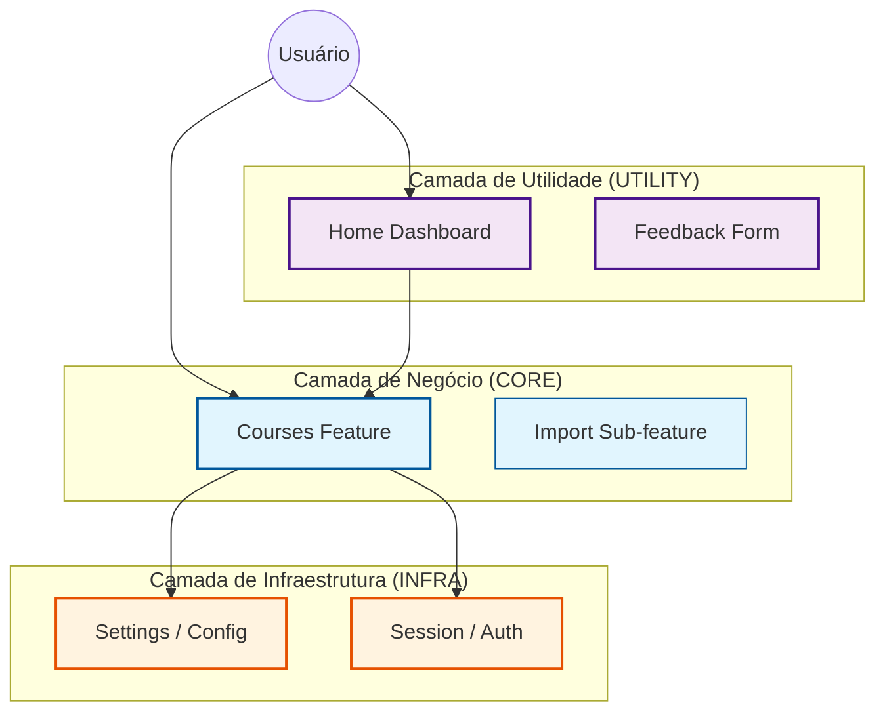

# 📂 Categorias de Features

Este documento detalha o sistema de classificação de features da **Screaming Architecture**. 
Nosso objetivo é que qualquer desenvolvedor saiba onde colocar seu código em < 10 segundos.

---

## 🧭 Mapa Mental

Entenda como as categorias se relacionam:

---

## 1. 🏆 CORE (O Coração)
**"A razão de ser do software."**

Se você deletar essas features, a extensão perde o propósito. Elas contêm as regras de negócio acadêmico.

- **Características**:
    - Tem `logic/` complexa e `models/` ricos.
    - Persiste dados críticos (`data/`).
- **Exemplos Atuais**:
    - `courses/`: O gerenciamento das matérias.
    - `courses/import/`: A inteligência de scraping (sub-feature).

## 2. 🔧 INFRA (O Alicerce)
**"Serviços que ninguém vê, mas todos usam."**

Fornecem capacidades técnicas transversais. Geralmente lidam com APIs do Browser (Chrome Storage, Cookies, Auth).

- **Características**:
    - Singleton ou Estado Global.
    - Abstrai complexidade técnica.
- **Exemplos Atuais**:
    - `session/`: Quem sou eu? Estou logado?
    - `settings/`: Preferências guardadas no sync.

## 3. 📦 UTILITY (Os Acessórios)
**"Melhoram a vida, mas não são vitais."**

Geralmente são telas de apoio, dashboards ou ferramentas auxiliares.

- **Características**:
    - Focadas em UX/UI.
    - Pouca lógica de negócio profunda.
- **Exemplos Atuais**:
    - `home/`: Tela de boas-vindas.
    - `feedback/`: Enviar bug report.

---

## 🚦 Algoritmo de Decisão

Na dúvida? Rode este "algoritmo mental":

1. **É vital para o aluno estudar?**
    - [Sim] -> **CORE** 🏆
    - [Não] -> Próximo passo...
    
2. **Outras features vão importar isso?**
    - [Sim] -> **INFRA** �
    - [Não] -> **UTILITY** 📦

---

> **Nota**: Para ver a estrutura de pastas técnica, vá para o [README das Features](./README.md).
