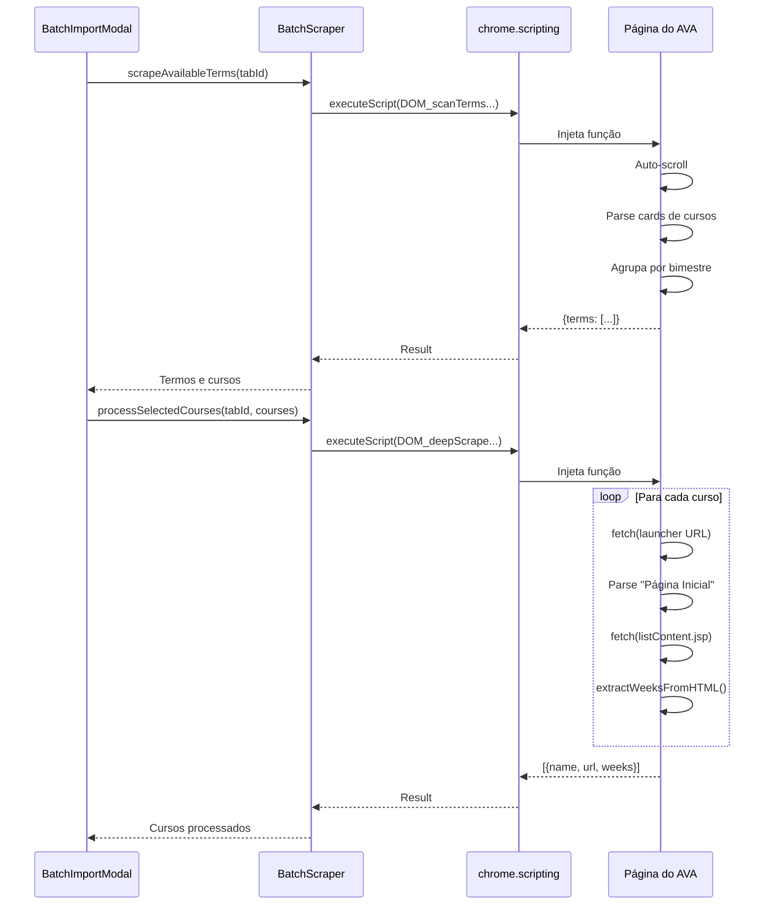

# 📦 BatchScraper

**"Importação em Lote de Cursos do AVA"**

> **Localização**: `features/courses/import/services/BatchScraper/`
> **Tipo**: Service (Batch Import via Injected Scripts)

Este service é responsável por escanear e importar múltiplos cursos simultaneamente da página principal do AVA, organizando-os por bimestre.

---

## 🎯 Responsabilidade

1. **Scan de Bimestres**: Detectar todos os cursos disponíveis na página `/ultra/course`.
2. **Agrupamento por Termo**: Organizar cursos por ano/semestre/bimestre (ex: "2025/1 - 1º Bimestre").
3. **Deep Scraping**: Buscar semanas de cursos selecionados através de múltiplos fetches.
4. **Auto-Scroll**: Carregar conteúdo lazy-loaded (Infinite Scroll) antes de escanear.

---

## 🏗️ Arquitetura (Injected Scripts)



---

## 📦 Componentes

### Funções Injetadas (Executam no DOM do AVA)

| Função | Responsabilidade | Linhas |
| :--- | :--- | ---: |
| **`DOM_scanTermsAndCourses_Injected()`** | Escaneia página inicial para detectar todos os cursos e agrupar por bimestre. | ~200 |
| **`DOM_deepScrapeSelected_Injected()`** | Faz deep scraping de cursos selecionados (busca semanas via fetch). | ~130 |
| **`extractWeeksFromHTML()` (helper)** | Parser de semanas a partir de HTML fetchado. | ~70 |

### Wrappers (Executam na Extensão)

| Função | Responsabilidade |
| :--- | :--- |
| **`scrapeAvailableTerms(tabId)`** | Wrapper que injeta `DOM_scanTermsAndCourses_Injected`. |
| **`processSelectedCourses(tabId, courses)`** | Wrapper que injeta `DOM_deepScrapeSelected_Injected`. |

---

## ⚠️ Limitação Técnica Importante

> [!WARNING]
> As funções injetadas **não podem usar imports ES6** porque são serializadas e executadas no contexto da página do AVA (não na extensão).
> 
> Por isso, todo o código permanece em um único arquivo (`index.js`) com helpers internos.

**Implicação:**
- Não podemos aplicar **Strategy Pattern** como no `WeekContentScraper`.
- A modularização é feita através de **funções internas bem organizadas** e **documentação clara**.

---

## 📝 Uso

```javascript
import { scrapeAvailableTerms, processSelectedCourses } from './BatchScraper/index.js';

// 1. Escanear cursos disponíveis
const { success, terms } = await scrapeAvailableTerms(tabId);
// terms: [{ name: "2025/1 - 1º Bimestre", courses: [...] }]

// 2. Deep scraping de cursos selecionados
const selectedCourses = [{ name: "C1", url: "...", courseId: "_123_1" }];
const results = await processSelectedCourses(tabId, selectedCourses);
// results: [{ name: "C1", url: "homepage_url", weeks: [...] }]
```

---

## 🧪 Testes

```bash
npm test features/courses/import/tests/BatchScraper
```

**Cobertura:**
- Testes de integração dos wrappers
- Mock de `chrome.scripting.executeScript`
- Testes DOM separados em `BatchScraper_DOM.test.js`

---

## 🔄 Fluxo de Dados

### 1. Scan de Termos

```javascript
Página /ultra/course
  ↓ (Auto-scroll para carregar tudo)
Cards de Curso (h4.js-course-title-element)
  ↓ (Parse de Display ID: MMB002-2025S1B2)
Agrupamento por Bimestre
  ↓
{
  "2025/1 - 1º Bimestre": [
    { name: "Matemática", courseId: "_123_1", url: "..." }
  ]
}
```

### 2. Deep Scraping

```javascript
Para cada curso selecionado:
  1. fetch(/launcher?type=Course&id=_123_1)
  2. Parse HTML → Buscar link "Página Inicial"
  3. fetch(listContent.jsp)
  4. extractWeeksFromHTML() → Parse links "Semana 1", "Semana 2"...
  5. Retornar { name, url, weeks: [...] }
```

---

## 📊 Métricas

- **Linhas**: 380 (auto-contido por necessidade técnica)
- **Funções Principais**: 3 (2 injetadas + 1 helper)
- **Wrappers**: 2
- **Testes**: 88 linhas (integração + DOM)

---

## 🔗 Ver Também

- [BatchImportModal.js](file:///home/sant/extensaoUNIVESP/features/courses/import/components/BatchImportModal.js)
- [WeekContentScraper](file:///home/sant/extensaoUNIVESP/features/courses/services/WeekContentScraper/README.md)
