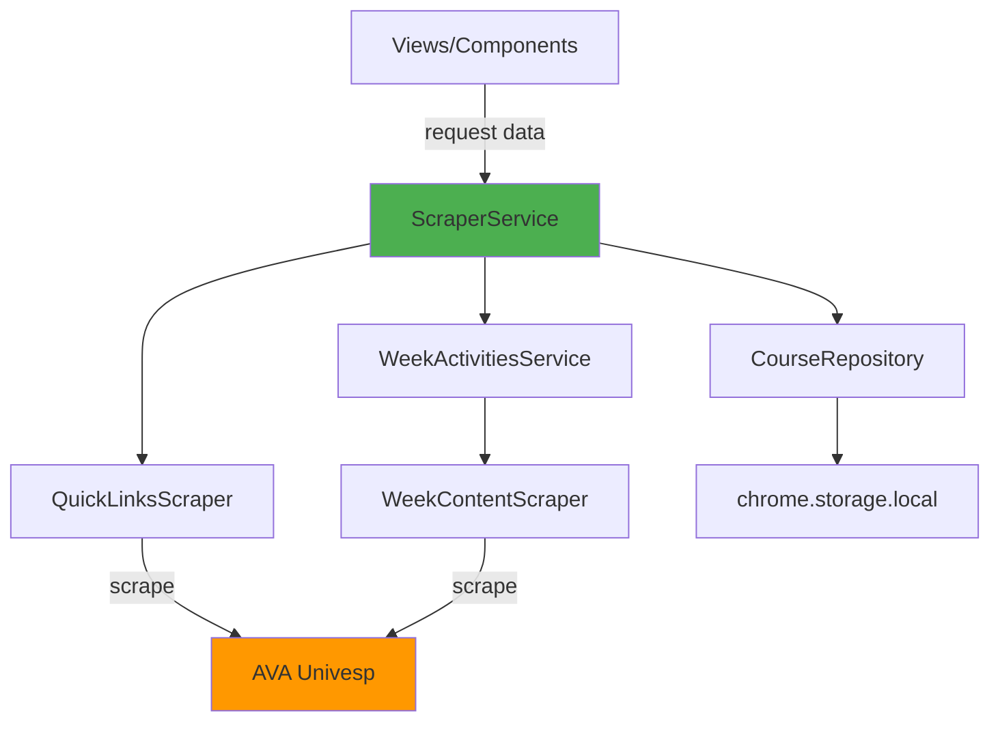

# 🛠️ Services Layer - Courses Feature

> **Localização**: `features/courses/services/`

Esta camada contém os **Services** (Orquestradores e Facades) que coordenam lógica de negócio, scraping, e integrações com APIs do Chrome.

---

## 🧩 Índice de Services

| Service | Responsabilidade | Dependências |
| :--- | :--- | :--- |
| **[CourseRefresher.js](file:///home/sant/extensaoUNIVESP/features/courses/services/CourseRefresher.js)** | Atualiza dados de um curso específico (força re-scraping). | `WeekContentScraper`, `CourseRepository` |
| **[QuickLinksScraper.js](file:///home/sant/extensaoUNIVESP/features/courses/services/QuickLinksScraper.js)** | Extrai lista de cursos e semanas do painel "Quick Links" do AVA. | `chrome.scripting` |
| **[ScraperService.js](file:///home/sant/extensaoUNIVESP/features/courses/services/ScraperService.js)** | **Facade Principal**. Orquestra scraping completo (cursos + semanas + atividades). | `QuickLinksScraper`, `WeekContentScraper`, `CourseRepository` |
| **[TaskProgressService.js](file:///home/sant/extensaoUNIVESP/features/courses/services/TaskProgressService.js)** | Calcula métricas de progresso (tarefas concluídas/totais). | Models (`Course`, `Week`) |
| **[WeekActivitiesService.js](file:///home/sant/extensaoUNIVESP/features/courses/services/WeekActivitiesService.js)** | Busca ou scrapa atividades de uma semana específica (com cache). | `WeekContentScraper`, `CourseRepository` |
| **[WeekContentScraper/](file:///home/sant/extensaoUNIVESP/features/courses/services/WeekContentScraper/)** | **Subpasta**: `WeekContentScraper` com Strategy Pattern. | Ver [WeekContentScraper/README.md](file:///home/sant/extensaoUNIVESP/features/courses/services/WeekContentScraper/README.md) |

---

## 🏗️ Arquitetura de Scraping



---

## 📋 Fluxos Comuns

### 1️⃣ Scraping Inicial (Primeiro Uso)
```javascript
import { ScraperService } from './services/ScraperService.js';

const courses = await ScraperService.scrapeCourses();
// → Retorna array de Course com semanas e atividades
```

**O que acontece:**
1. `QuickLinksScraper` extrai lista de cursos/semanas
2. Para cada semana, `WeekContentScraper` extrai atividades
3. `CourseRepository` persiste tudo no `chrome.storage.local`

### 2️⃣ Carregar Semana com Cache
```javascript
import { WeekActivitiesService } from './services/WeekActivitiesService.js';

const items = await WeekActivitiesService.getWeekActivities(
  courseId,
  weekId
);
// → Se cache válido, retorna local. Senão, scrapa.
```

### 3️⃣ Calcular Progresso
```javascript
import { TaskProgressService } from './services/TaskProgressService.js';

const { completed, total, percentage } = TaskProgressService.calculateProgress(course);
// → { completed: 8, total: 12, percentage: 66.67 }
```

---

## 🧪 Testes

Cada service tem arquivo de teste correspondente em `features/courses/tests/services/`.

```bash
npm test features/courses/tests/services/
```

---

## 🎯 Princípios de Design

1. **Single Responsibility**: Cada service tem UMA responsabilidade clara.
2. **Dependency Injection**: Services recebem dependências (ex: Repository) via parâmetros ou imports explícitos.
3. **Facade Pattern**: `ScraperService` é a facade que esconde complexidade de múltiplos scrapers.
4. **Strategy Pattern**: `WeekContentScraper` usa strategies para diferentes tipos de conteúdo.

---

## 📌 Convenções

- **Prefixo "Service"**: Arquivos terminam com `Service.js` se orquestram múltiplas operações.
- **Prefixo "Scraper"**: Arquivos terminam com `Scraper.js` se fazem parsing de DOM.
- **Métodos Estáticos**: Services são stateless, expõem métodos `static`.
- **Async/Await**: Todo scraping usa `async/await` devido a `chrome.scripting.executeScript`.

---

## 🔗 Ver Também

- [Architecture Docs](file:///home/sant/extensaoUNIVESP/docs/TECNOLOGIAS_E_ARQUITETURA.md)
- [Models](file:///home/sant/extensaoUNIVESP/features/courses/models/)
- [Repository Pattern](file:///home/sant/extensaoUNIVESP/features/courses/repository/)
