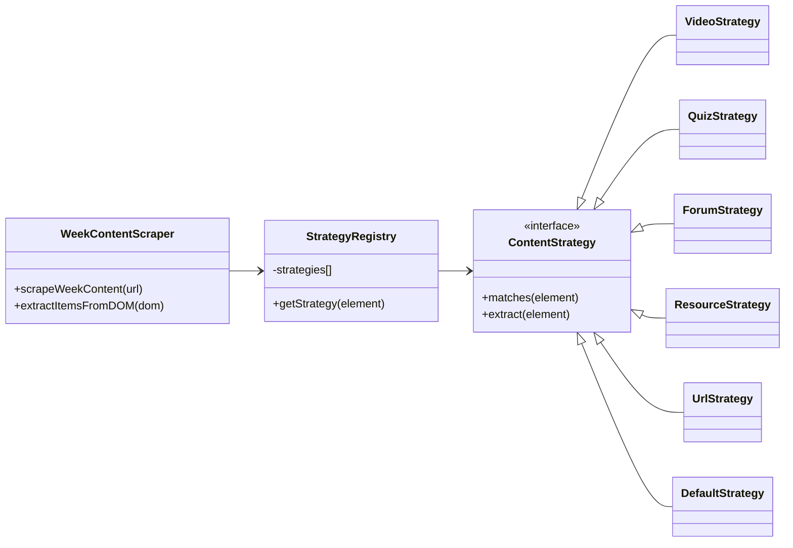
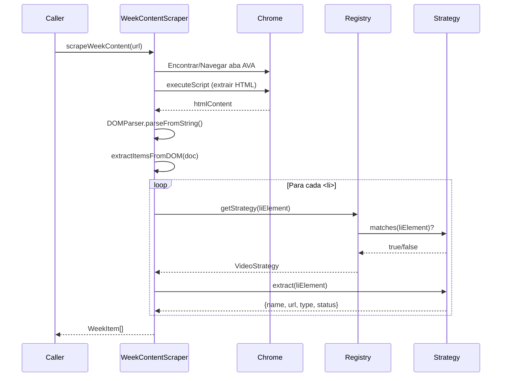

# 🔍 WeekContentScraper

**"Extrator Inteligente de Conteúdo do AVA"**

> **Localização**: `features/courses/services/WeekContentScraper/`
> **Tipo**: Service (Scraping + Strategy Pattern)

Este service é responsável por extrair a lista de atividades/conteúdos de uma semana do AVA da UNIVESP e normalizá-la em estrutura de dados consistente.

---

## 🎯 Responsabilidade

1. **Navegação de Abas**: Garantir que a aba correta do AVA esteja aberta antes de fazer scraping.
2. **Extração de HTML**: Injetar script para capturar HTML bruto da página do AVA.
3. **Parsing Estratégico**: Usar Strategy Pattern para identificar e extrair diferentes tipos de conteúdo.
4. **Normalização**: Retornar array de `WeekItem[]` com estrutura consistente.

---

## 🏗️ Arquitetura (Strategy Pattern)



### 📦 Componentes

| Arquivo | Responsabilidade |
| :--- | :--- |
| **[WeekContentScraper.js](file:///home/sant/extensaoUNIVESP/features/courses/services/WeekContentScraper.js)** | **Context**. Orquestra navegação e delega parsing. |
| **[StrategyRegistry.js](file:///home/sant/extensaoUNIVESP/features/courses/services/WeekContentScraper/StrategyRegistry.js)** | **Factory**. Gerencia estratégias e seleciona a correta. |
| **[strategies/ContentStrategy.js](file:///home/sant/extensaoUNIVESP/features/courses/services/WeekContentScraper/strategies/ContentStrategy.js)** | **Interface**. Define contrato `matches()` + `extract()`. |
| **strategies/VideoStrategy.js** | Extrai vídeos (detecta por ícone). |
| **strategies/QuizStrategy.js** | Extrai questionários (ícone + URL). |
| **strategies/ForumStrategy.js** | Extrai fóruns. |
| **strategies/ResourceStrategy.js** | Extrai PDFs e arquivos. |
| **strategies/UrlStrategy.js** | Extrai links externos. |
| **strategies/DefaultStrategy.js** | Fallback robusto para itens genéricos. |

---

## 🔄 Fluxo de Execução



---

## 📝 Uso

```javascript
import { WeekContentScraper } from './services/WeekContentScraper.js';

// Scraping via Chrome Extension
const items = await WeekContentScraper.scrapeWeekContent(
  'https://ava.univesp.br/course/view.php?course_id=_123_1&content_id=_456_1'
);

// Parsing de DOM local (testes)
const doc = new DOMParser().parseFromString(html, 'text/html');
const items = WeekContentScraper.extractItemsFromDOM(doc);
```

**Output:**
```javascript
[
  {
    name: "Videoaula 1 - Introdução",
    url: "https://ava.univesp.br/mod/url/view.php?id=123",
    type: "video",
    status: "DONE"
  },
  {
    name: "Quiz Semanal",
    url: "https://ava.univesp.br/mod/quiz/view.php?id=456",
    type: "quiz",
    status: "TODO"
  }
]
```

---

## 🧪 Testes

```bash
npm test features/courses/tests/services/WeekContentScraper.test.js
```

Cobertura: 12 cenários incluindo detecção de tipos, status, navegação de abas.

---

## ➕ Como Adicionar Novo Tipo

1. Criar `strategies/AssignmentStrategy.js`:
```javascript
import { ContentStrategy } from './ContentStrategy.js';

export class AssignmentStrategy extends ContentStrategy {
  matches(element) {
    const icon = element.querySelector('img.item_icon');
    return icon?.alt.includes('Tarefa');
  }

  extract(element) {
    // ... lógica de extração
    return { name, url, type: 'assignment', status };
  }
}
```

2. Registrar em `StrategyRegistry.js`:
```javascript
import { AssignmentStrategy } from './strategies/AssignmentStrategy.js';

this.strategies = [
  // ...
  new AssignmentStrategy(),
  new DefaultStrategy()
];
```

---

## 📊 Métricas

- **Linhas**: 291 (antes: 420)
- **Complexidade Ciclomática**: Baixa (lógica distribuída)
- **Cobertura de Testes**: 100% dos cenários críticos
