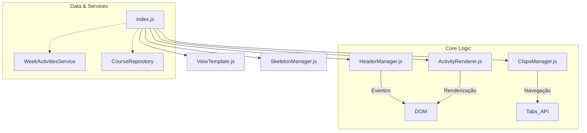

# 🔍 DetailsActivitiesWeekView

**"O Coração da Produtividade"**

> **Localização**: `features/courses/views/DetailsActivitiesWeekView/`
> **Tipo**: View Complexa (Modularizada)

Esta é a view mais crítica do sistema, responsável por transformar a abstração do AVA em uma **lista de tarefas acionáveis e navegáveis**. É aqui que o aluno passa a maior parte do tempo de estudo.

---

## 🎯 Responsabilidade

1.  **Exibir Atividades**: Listar todo o conteúdo da semana (Vídeos, Textos, Quizzes) em ordem sequencial.
2.  **Navegação Contextual**: Permitir alternar entre semanas sem voltar ao menu anterior (Chips).
3.  **Persistência**: Garantir que dados carregados não sejam perdidos (Auto-Save).
4.  **Deep Linking**: Ao clicar em uma atividade, abrir o AVA, navegar até a semana correta e rolar a página até o item específico.

---

## 🧩 Arquitetura Modular

Devido à sua complexidade, esta View foi refatorada em **sub-módulos especializados** seguindo o Single Responsibility Principle (SRP).



### 📦 Componentes Internos

| Arquivo | Responsabilidade |
| :--- | :--- |
| **`index.js`** | **Orquestrador**. Inicializa componentes, gerencia estado (`week`) e conecta callbacks. |
| **`ViewTemplate.js`** | **HTML Structure**. Contém apenas strings de template. Zero lógica. |
| **`HeaderManager.js`** | **Header Logic**. Gerencia listeners dos botões (Voltar, Refresh, Clear). |
| **`ChipsManager.js`** | **Context Navigation**. Gerencia a renderização e eventos dos "Chips" de semanas. |
| **`ActivityRenderer.js`** | **List Logic**. Renderiza a lista principal de atividades. |
| **`ActivityItemFactory.js`** | **Item Creation**. Factory pattern para criar elementos DOM de atividade individual. |
| **`SkeletonManager.js`** | **Loading State**. Renderiza placeholders visuais enquanto dados carregam. |
| **`handlers/*.js`** | **Action Handlers**. Lógica encapsulada para ações específicas (`Clear`, `Refresh`). |

---

## ⚙️ Funcionalidades Chave

### 1. Navegação Contextual (Chips)
- **Problema**: Usuário precisava voltar para a lista de semanas para mudar de semana.
- **Solução**: Chips no topo da view permitem troca rápida.
- **Sincronia**: Ao clicar, o navegador abre a nova aba E a extensão atualiza a view (`onNavigateToWeek`).

### 2. Auto-Save & Persistência
- **Problema**: Dados de scraping eram perdidos ao fechar a extensão.
- **Solução**: Dados são salvos em `chrome.storage.local` imediatamente após o scraping (`CourseRepository.update`).

### 3. Scroll Automático (`scrollToActivity`)
- Lógica complexa que:
    1. Verifica se a aba do AVA está aberta.
    2. Navega para a URL da semana correta.
    3. Injeta script na página para rolar até o elemento HTML específico.
    4. Destaca o elemento visualmente.

---

## 🛠️ Contrato de Callbacks

A View espera os seguintes callbacks no construtor:

```javascript
new DetailsActivitiesWeekView({
  onBack: () => {},            // Voltar para lista de semanas
  onNavigateToWeek: (week) => {} // Troca de semana via Chip
})
```
