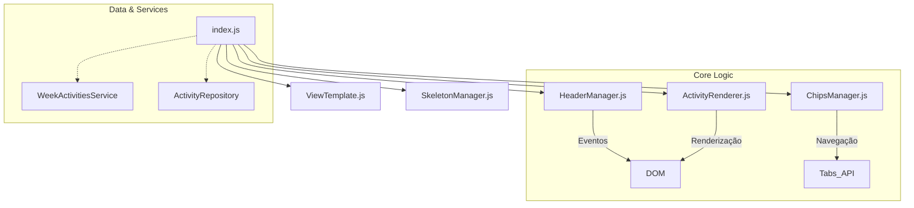

# 🔍 DetailsActivitiesWeekView

**"O Coração da Produtividade"**

> **Localização**: `features/courses/views/DetailsActivitiesWeekView/`
> **Tipo**: View Complexa (Modularizada)
> **Versão**: v2.9.1 - **Robust Scroll Navigation**

Esta é a view mais crítica do sistema, responsável por transformar a abstração do AVA em uma **lista de tarefas acionáveis e navegáveis**. É aqui que o aluno passa a maior parte do tempo de estudo.

---

## 🎯 Responsabilidade

1.  **Exibir Atividades**: Listar todo o conteúdo da semana (Vídeos, Textos, Quizzes) em ordem sequencial.
2.  **Navegação Contextual**: Permitir alternar entre semanas sem voltar ao menu anterior (Chips).
3.  **Persistência**: Garantir que dados carregados não sejam perdidos (Auto-Save).
4.  **Deep Linking**: Ao clicar em uma atividade, abrir o AVA, navegar até a semana correta e rolar a página até o item específico.

---

## 🧩 Arquitetura Modular

Devido à sua complexidade, esta View foi refatorada em **sub-módulos especializados** seguindo o Single Responsibility Principle (SRP).



### 📦 Componentes Internos

| Arquivo | Responsabilidade |
| :--- | :--- |
| **`index.js`** | **Orquestrador**. Inicializa componentes, gerencia estado (`week`) e conecta callbacks. |
| **`ViewTemplate.js`** | **HTML Structure**. Contém apenas strings de template. Zero lógica. |
| **`HeaderManager.js`** | **Header Logic**. Gerencia listeners dos botões (Voltar, Refresh, Clear). |
| **`ChipsManager.js`** | **Context Navigation**. Gerencia a renderização e eventos dos "Chips" de semanas. |
| **`ActivityRenderer.js`** | **List Logic**. Renderiza a lista principal de atividades. |
| **`ActivityItemFactory.js`** | **Item Creation**. Factory pattern para criar elementos DOM de atividade individual. |
| **`SkeletonManager.js`** | **Loading State**. Renderiza placeholders visuais enquanto dados carregam. |
| **`handlers/*.js`** | **Action Handlers**. Lógica encapsulada para ações específicas (`Clear`, `Refresh`). |

---

## ⚙️ Funcionalidades Chave

### 1. Navegação Contextual (Chips)
- **Problema**: Usuário precisava voltar para a lista de semanas para mudar de semana.
- **Solução**: Chips no topo da view permitem troca rápida.
- **Sincronia**: Ao clicar, o navegador abre a nova aba E a extensão atualiza a view (`onNavigateToWeek`).

### 2. Cache de Atividades (localStorage)
- **Problema**: Dados de scraping eram perdidos ao fechar a extensão.
- **Solução**: Atividades são salvas em `ActivityRepository` (localStorage, 5MB quota) imediatamente após scraping.
- **Chave**: `activities_{courseId}_{contentId}` para isolar por semana.
- **Fonte da Verdade v2.9.1**: [`ActivityRepository.js`](../../repositories/ActivityRepository.js)

### 3. Scroll Automático Robusto (`scrollToActivity`) (v2.9.1)
- Lógica resiliente (ADR-007) que:
    1. Verifica se a aba do AVA está aberta.
    2. Navega para a URL da semana correta.
    3. Monitora o DOM com `MutationObserver` (até 10s) para encontrar o elemento alvo.
    4. Tenta múltiplas estratégias de seleção de IDs.
    5. Destaca o elemento visualmente (Piscada dourada).
    6. **Logs Semânticos**: Registro detalhado com `/**#LOG_NAVIGATION*/` para debug.

---

## 🛠️ Contrato de Callbacks

A View espera os seguintes callbacks no construtor:

```javascript
new DetailsActivitiesWeekView({
  onBack: () => {},            // Voltar para lista de semanas
  onNavigateToWeek: (week) => {} // Troca de semana via Chip
})
```

---

## 🛡️ v2.9.1: Estabilidade, Logs e Robustez de Navegação

**Problema:** Após re-renderização da view, `ActivityRenderer` renderizava no container **antigo** (zumbi), deixando UI com Skeleton infinito.

**Solução (Container Freshness):**
- **`index.js`** agora SEMPRE cria novo `ActivityRenderer` com container fresco:
  ```javascript
  renderActivities() {
    const container = this.element?.querySelector('#activitiesContainer');
    const renderer = new ActivityRenderer(container); // ✅ SEMPRE NOVO
    renderer.renderActivities(this.week?.items || []);
  }
  ```

**Proteção (Testes de Regressão):**
- **5 testes** em `rendering-regression.test.js` garantem que bug não retorne:
  1. Múltiplas renderizações (Skeleton → Dados)
  2. Container sempre é o elemento VISÍVEL
  3. View com dados desde o início
  4. Navegação entre semanas
  5. Estado de erro

**Impacto:** Se alguém tentar cachear `this.activityRenderer`, os testes falham imediatamente.

**Referência:** [`ADR_006_CONTAINER_FRESHNESS.md`](../../../../docs/architecture/ADR_006_CONTAINER_FRESHNESS.md)
